[b站黑马教学视频传送门](https://www.bilibili.com/video/BV1S142197x7?spm_id_from=333.788.videopod.episodes&bvid=BV1S142197x7&vd_source=796ed40051b301bfa3a84ba357f4828c&p=2)

[黑马官方飞书笔记传送门](https://b11et3un53m.feishu.cn/wiki/space/7229522334074372099?ccm_open_type=lark_wiki_spaceLink&open_tab_from=wiki_home)

**个人笔记(黑马官方飞书笔记改)：**

大家在日常开发中应该能发现，单表的CRUD功能代码重复度很高，也没有什么难度。而这部分代码量往往比较大，开发起来比较费时。

因此，目前企业中都会使用一些组件来简化或省略单表的CRUD开发工作。目前在国内使用较多的一个组件就是MybatisPlus.

官方网站如下：

[MyBatis-Plus 🚀 为简化开发而生](https://www.baomidou.com/)

<iframe src="https://www.baomidou.com/" width="100%" height="500px"></iframe>

当然，MybatisPlus不仅仅可以简化单表操作，而且还对Mybatis的功能有很多的增强。可以让我们的开发更加的简单，高效。

通过今天的学习，我们要达成下面的目标：

- 能利用MybatisPlus实现基本的CRUD
- 会使用条件构建造器构建查询和更新语句
- 会使用MybatisPlus中的常用注解
- 会使用MybatisPlus处理枚举、JSON类型字段
- 会使用MybatisPlus实现分页

# 1. 快速入门

为了方便测试，我们先创建一个新的项目，并准备一些基础数据。

将使用mybatis操作单表的基础操作改为mybaitsplus实现

## 1.1 环境准备

复制课前资料提供好的一个项目到你的工作空间（不要包含空格和特殊字符）：


然后用你的IDEA工具打开，项目结构如下：

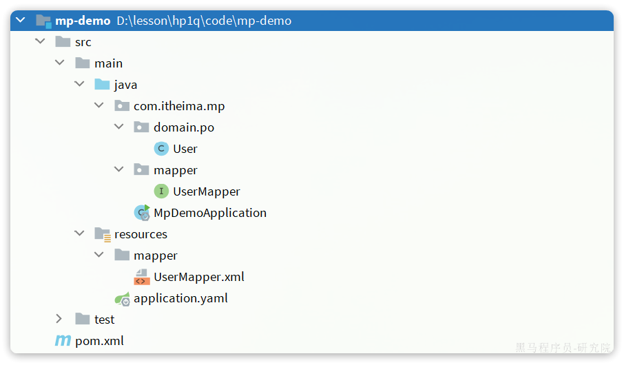

注意配置一下项目的JDK版本为JDK11。首先点击项目结构设置：

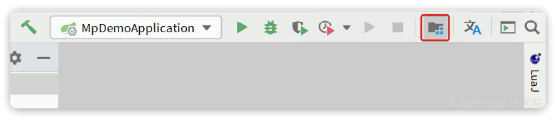

在弹窗中配置JDK：


接下来，要导入两张表，在课前资料中已经提供了SQL文件：

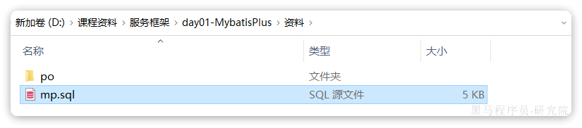

对应的数据库表结构如下：

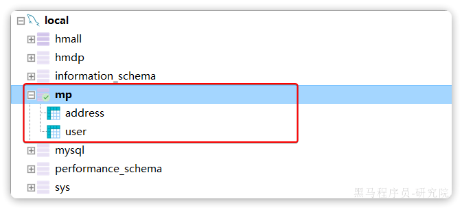
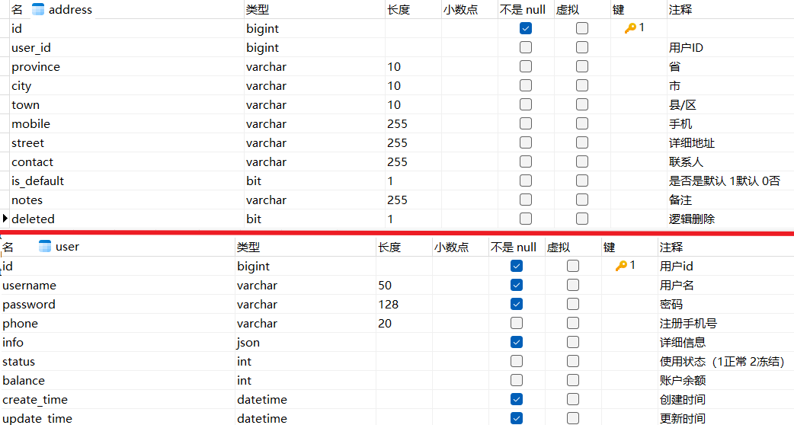

最后，在`application.yaml`中修改jdbc参数为你自己的数据库参数：

```YAML
spring:
  datasource:
    url: jdbc:mysql://127.0.0.1:3306/mp?useUnicode=true&characterEncoding=UTF-8&autoReconnect=true&serverTimezone=Asia/Shanghai
    driver-class-name: com.mysql.cj.jdbc.Driver
    username: root
    password: 123456
logging:
  level:
    com.itheima: debug
  pattern:
    dateformat: HH:mm:ss
mybatis:
  mapper-locations: classpath*:mapper/*.xml
```

## 1.2 快速开始

MyBatisPlus官方提供了starter，其中集成了Mybatis和MybatisPlus的所有功能，并且实现了自动装配效果。

因此我们可以用MybatisPlus的starter代替Mybatis的starter：

```XML
<dependencies>
    <!--
        <dependency>
            <groupId>org.mybatis.spring.boot</groupId>
            <artifactId>mybatis-spring-boot-starter</artifactId>
            <version>2.3.1</version>
        </dependency>
    -->
    <!-- 用MybatisPlus的starter代替Mybatis的starter -->
    <dependency>
        <groupId>com.baomidou</groupId>
        <artifactId>mybatis-plus-boot-starter</artifactId>
        <version>3.5.3.1</version>
    </dependency>
    
    <dependency>
        <groupId>com.mysql</groupId>
        <artifactId>mysql-connector-j</artifactId>
        <scope>runtime</scope>
    </dependency>
    <dependency>
        <groupId>org.projectlombok</groupId>
        <artifactId>lombok</artifactId>
        <optional>true</optional>
    </dependency>
    <dependency>
        <groupId>org.springframework.boot</groupId>
        <artifactId>spring-boot-starter-test</artifactId>
        <scope>test</scope>
    </dependency>
</dependencies>
```

springboot3 记得用mybatis-plus-spring-boot3-starter

## 1.2 快速开始

MyBatisPlus使用的基本流程是什么？

1. 引入起步依赖
2. 自定义Mapper基础BaseMapper
3. 在实体类上添加注解声明表信息(根据需要)
4. 在application.yml中根据需要添加配置

比如我们要实现User表的CRUD，只需要下面几步：

- 引入MybatisPlus依赖
- 定义Mapper

### 1.2.1 引入依赖

MybatisPlus提供了starter，实现了自动Mybatis以及MybatisPlus的自动装配功能，坐标如下：

```XML
<dependency>
    <groupId>com.baomidou</groupId>
    <artifactId>mybatis-plus-boot-starter</artifactId>
    <version>3.5.3.1</version>
</dependency>
```

由于这个starter包含对mybatis的自动装配，因此完全可以替换掉Mybatis的starter。 最终，项目的依赖如下：

```XML
<dependencies>
    <dependency>
        <groupId>com.baomidou</groupId>
        <artifactId>mybatis-plus-boot-starter</artifactId>
        <version>3.5.3.1</version>
    </dependency>
    <dependency>
        <groupId>com.mysql</groupId>
        <artifactId>mysql-connector-j</artifactId>
        <scope>runtime</scope>
    </dependency>
    <dependency>
        <groupId>org.projectlombok</groupId>
        <artifactId>lombok</artifactId>
        <optional>true</optional>
    </dependency>
    <dependency>
        <groupId>org.springframework.boot</groupId>
        <artifactId>spring-boot-starter-test</artifactId>
        <scope>test</scope>
    </dependency>
</dependencies>
```

### 1.2.2 定义Mapper

为了简化单表CRUD，MybatisPlus提供了一个基础的`BaseMapper`接口，其中已经实现了单表的CRUD：


因此我们自定义的Mapper只要实现了这个`BaseMapper`，就无需自己实现单表CRUD了。 修改mp-demo中的`com.itheima.mp.mapper`包下的`UserMapper`接口，让其继承`BaseMapper`：


代码如下：

```Java
package com.itheima.mp.mapper;

import com.baomidou.mybatisplus.core.mapper.BaseMapper;
import com.itheima.mp.domain.po.User;

public interface UserMapper extends BaseMapper<User> {
}
```

### 1.2.3 测试

新建一个测试类，编写几个单元测试，测试基本的单表CRUD功能：

```Java
package com.itheima.mp.mapper;

import com.itheima.mp.domain.po.User;
import org.junit.jupiter.api.Test;
import org.springframework.beans.factory.annotation.Autowired;
import org.springframework.boot.test.context.SpringBootTest;

import java.time.LocalDateTime;
import java.util.List;

@SpringBootTest
class UserMapperTest {

    @Autowired
    private UserMapper userMapper;

    @Test
    void testInsert() {
        User user = new User();
        user.setId(5L);
        user.setUsername("Lucy");
        user.setPassword("123");
        user.setPhone("18688990011");
        user.setBalance(200);
        user.setInfo("{\"age\": 24, \"intro\": \"英文老师\", \"gender\": \"female\"}");
        user.setCreateTime(LocalDateTime.now());
        user.setUpdateTime(LocalDateTime.now());
        userMapper.insert(user);
    }

    @Test
    void testSelectById() {
        User user = userMapper.selectById(5L);
        System.out.println("user = " + user);
    }

    @Test
    void testSelectByIds() {
        List<User> users = userMapper.selectBatchIds(List.of(1L, 2L, 3L, 4L, 5L));
        users.forEach(System.out::println);
    }

    @Test
    void testUpdateById() {
        User user = new User();
        user.setId(5L);
        user.setBalance(20000);
        userMapper.updateById(user);
    }

    @Test
    void testDelete() {
        userMapper.deleteById(5L);
    }
}
```

可以看到，在运行过程中打印出的SQL日志，非常标准：

```SQL
11:05:01  INFO 15524 --- [           main] com.zaxxer.hikari.HikariDataSource       : HikariPool-1 - Starting...
11:05:02  INFO 15524 --- [           main] com.zaxxer.hikari.HikariDataSource       : HikariPool-1 - Start completed.
11:05:02 DEBUG 15524 --- [           main] c.i.mp.mapper.UserMapper.selectById      : ==>  Preparing: SELECT id,username,password,phone,info,status,balance,create_time,update_time FROM user WHERE id=?
11:05:02 DEBUG 15524 --- [           main] c.i.mp.mapper.UserMapper.selectById      : ==> Parameters: 5(Long)
11:05:02 DEBUG 15524 --- [           main] c.i.mp.mapper.UserMapper.selectById      : <==      Total: 1
user = User(id=5, username=Lucy, password=123, phone=18688990011, info={"age": 21}, status=1, balance=20000, createTime=Fri Jun 30 11:02:30 CST 2023, updateTime=Fri Jun 30 11:02:30 CST 2023)
```

只需要继承BaseMapper就能省去所有的单表CRUD，是不是非常简单！

## 1.3 常见注解

| 常见注解      | 功能                           |
| ------------- | ------------------------------ |
| `@TableName`  | 用来指定**表名**               |
| `@TableId`    | 用来指定表中的**主键字段**信息 |
| `@TableFieId` | 用来指定表中的**普通字段**信息 |

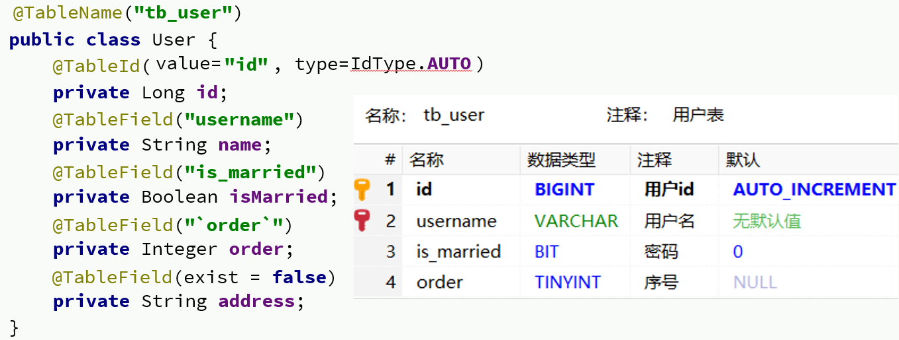

在刚刚的入门案例中，我们仅仅引入了依赖，继承了BaseMapper就能使用MybatisPlus，非常简单。但是问题来了： **MybatisPlus如何知道我们要查询的是哪张表？表中有哪些字段呢？**

MyBatisPlus通过扫描实体类，并基于反射获取实体类信息作为数据库表信息。

大家回忆一下，UserMapper在继承BaseMapper的时候指定了一个泛型：


泛型中的User就是与数据库对应的PO.

MybatisPlus就是**根据PO实体的信息来推断出表的信息，从而生成SQL的**。默认情况下：

- MybatisPlus会把PO实体的**类名驼峰转下划线作为表名**
- MybatisPlus会把PO实体的所有**变量名驼峰转下划线作为表的字段名**，并根据**变量类型推断字段类型**
- MybatisPlus会把名为**id的字段作为主键**

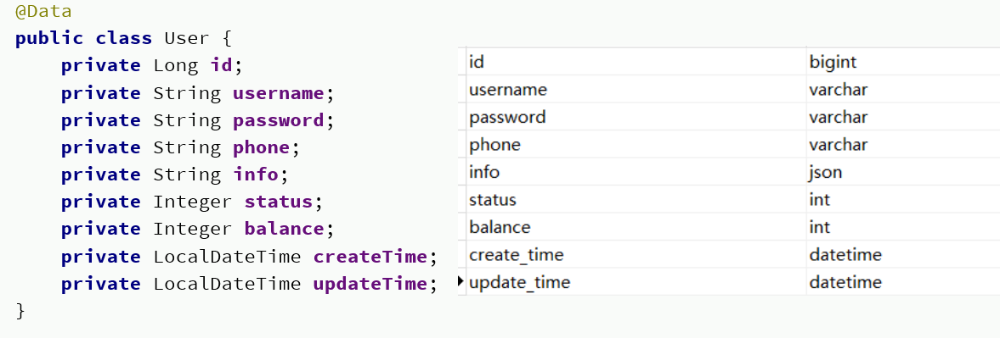

**但很多情况下，默认的实现与实际场景不符，因此MybatisPlus提供了一些注解便于我们声明表信息。**

### 1.3.1 @TableName

说明：

- 描述：表名注解，**标识实体类对应的表**
- 使用位置：实体类

示例：

```Java
@TableName("user")
public class User {
    private Long id;
    private String name;
}
```

TableName注解除了指定表名以外，还可以指定很多其它属性：

| 属性             | 类型     | 必须指定 | 默认值 | 描述                                                         |
| ---------------- | -------- | -------- | ------ | ------------------------------------------------------------ |
| value            | String   | 否       | ""     | 表名                                                         |
| schema           | String   | 否       | ""     | schema                                                       |
| keepGlobalPrefix | boolean  | 否       | false  | 是否保持使用全局的 tablePrefix 的值（当全局 tablePrefix 生效时） |
| resultMap        | String   | 否       | ""     | xml 中 resultMap 的 id（用于满足特定类型的实体类对象绑定）   |
| autoResultMap    | boolean  | 否       | false  | 是否自动构建 resultMap 并使用（如果设置 resultMap 则不会进行 resultMap 的自动构建与注入） |
| excludeProperty  | String[] | 否       | {}     | 需要排除的属性名 @since 3.3.1                                |

### 1.3.2 @TableId

说明：

- 描述：主键注解，标识实体类中的主键字段
- 使用位置：实体类的主键字段

示例：

```Java
@TableName("user")
public class User {
    @TableId
    private Long id;
    private String name;
}
```

`TableId`注解支持两个属性：

| 属性  | 类型   | 必须指定 | 默认值      | 描述         |
| :---- | :----- | :------- | :---------- | :----------- |
| value | String | 否       | ""          | 表名         |
| type  | Enum   | 否       | IdType.NONE | 指定主键类型 |

`IdType`支持的类型有：

| 值            | 描述                                                         |
| :------------ | :----------------------------------------------------------- |
| AUTO          | 数据库 ID **自增，如果不指定自增长且插入时未指定值，则根据雪花算法算出一个id(一个较长的long类型)** |
| NONE          | 无状态，该类型为未设置主键类型（注解里等于跟随全局，全局里约等于 INPUT） |
| INPUT         | insert 前自行 set 主键值                                     |
| ASSIGN_ID     | 分配 ID(主键类型为 Number(Long 和 Integer)或 String)(since 3.3.0),使用接口IdentifierGenerator的方法nextId(默认实现类为DefaultIdentifierGenerator雪花算法) |
| ASSIGN_UUID   | 分配 UUID,主键类型为 String(since 3.3.0),使用接口IdentifierGenerator的方法nextUUID(默认 default 方法) |
| ID_WORKER     | 分布式全局唯一 ID 长整型类型(please use ASSIGN_ID)           |
| UUID          | 32 位 UUID 字符串(please use ASSIGN_UUID)                    |
| ID_WORKER_STR | 分布式全局唯一 ID 字符串类型(please use ASSIGN_ID)           |

这里比较常见的有三种：

- `AUTO`：利用数据库的id自增长
- `INPUT`：手动生成id
- `ASSIGN_ID`：雪花算法生成`Long`类型的全局唯一id，这是默认的ID策略

### 1.3.3 @TableField

说明：

> 描述：普通字段注解

示例：

```Java
@TableName("user")
public class User {
    @TableId
    private Long id;
    private String name;
    private Integer age;
    @TableField("isMarried")
    private Boolean isMarried;
    @TableField("concat")
    private String concat;
}
```

**一般情况下我们并不需要给字段添加`@TableField`注解**，一些特殊情况除外：

- 成员**变量名与**数据库**字段名不一致**
- **成员变量是以`isXXX`命名**，按照`JavaBean`的规范，**`MybatisPlus`识别字段时会把`is`去除**，这就导致与数据库不符。
- 成员变量名与数据库**一致，但**是**与数据库的关键字冲突**。**使用`@TableField`注解给字段名添加转义字符**：` `` `

支持的其它属性如下：

| 属性             | 类型       | 必填 | 默认值                | 描述                                                         |
| ---------------- | ---------- | ---- | --------------------- | ------------------------------------------------------------ |
| value            | String     | 否   | ""                    | 数据库字段名                                                 |
| exist            | boolean    | 否   | true                  | 是否为数据库表字段                                           |
| condition        | String     | 否   | ""                    | 字段 where 实体查询比较条件，有值设置则按设置的值为准，没有则为默认全局的 %s=#{%s}，[参考(opens new window)](https://github.com/baomidou/mybatis-plus/blob/3.0/mybatis-plus-annotation/src/main/java/com/baomidou/mybatisplus/annotation/SqlCondition.java) |
| update           | String     | 否   | ""                    | 字段 update set 部分注入，例如：当在version字段上注解update="%s+1" 表示更新时会 set version=version+1 （该属性优先级高于 el 属性） |
| insertStrategy   | Enum       | 否   | FieldStrategy.DEFAULT | 举例：`NOT_NULL insert into table_a(<if test="columnProperty != null">column</if>) values (<if test="columnProperty != null">#{columnProperty}</if>)` |
| updateStrategy   | Enum       | 否   | FieldStrategy.DEFAULT | 举例：IGNORED update table_a set column=#{columnProperty}    |
| whereStrategy    | Enum       | 否   | FieldStrategy.DEFAULT | 举例：NOT_EMPTY where <if test="columnProperty != null and columnProperty!=''">column=#{columnProperty}</if> |
| fill             | Enum       | 否   | FieldFill.DEFAULT     | 字段自动填充策略                                             |
| select           | boolean    | 否   | true                  | 是否进行 select 查询                                         |
| keepGlobalFormat | boolean    | 否   | false                 | 是否保持使用全局的 format 进行处理                           |
| jdbcType         | JdbcType   | 否   | JdbcType.UNDEFINED    | JDBC 类型 (该默认值不代表会按照该值生效)                     |
| typeHandler      | TypeHander | 否   |                       | 类型处理器 (该默认值不代表会按照该值生效)                    |
| numericScale     | String     | 否   | ""                    | 指定小数点后保留的位数                                       |

## 1.4 常见配置

MybatisPlus也支持基于yaml文件的自定义配置，详见官方文档：

[使用配置 | MyBatis-Plus](https://www.baomidou.com/reference/)

<iframe src="https://www.baomidou.com/reference/" width="100%" height="500px"></iframe>

常用的配置：

```yaml
mybatis-plus:
	type-aliases-package: com.itheima.mp.domain.po # 别名扫描包
    mapper-locations: "classpath*:/mapper/**/*.xml" # Mapper.xml文件地址，默认值
    configuration:
    	map-underscore-to-camel-case: true # 是否开启下划线和驼峰的映射
    	cache-enabled: false # 是否开启二级缓存
  global-config:
  	db-config:
  		id-type: assign_id # id为雪花算法生成
  		update-strategy: not_null # 更新策略：只更新非空字段
```

大多数的配置都有默认值，因此我们都无需配置。但还有一些是没有默认值的，例如:

- 实体类的别名扫描包
- 全局id类型

```YAML
mybatis-plus:
  type-aliases-package: com.itheima.mp.domain.po # 实体类的别名扫描包
  global-config:
    db-config:
      id-type: auto # 全局id类型为自增长
```

需要注意的是，MyBatisPlus也支持手写SQL的，而mapper文件的读取地址可以自己配置：

```YAML
mybatis-plus:
  mapper-locations: "classpath*:/mapper//*.xml" # Mapper.xml文件地址，当前这个是默认值。
```

可以看到默认值是`classpath*:/mapper//*.xml`，也就是说我们只要把mapper.xml文件放置这个目录下就一定会被加载。

例如，我们新建一个`UserMapper.xml`文件：


然后在其中定义一个方法：

```XML
<?xml version="1.0" encoding="UTF-8"?>
<!DOCTYPE mapper PUBLIC "-//mybatis.org//DTD Mapper 3.0//EN" "http://mybatis.org/dtd/mybatis-3-mapper.dtd">
<mapper namespace="com.itheima.mp.mapper.UserMapper">

    <select id="queryById" resultType="User">
        SELECT * FROM user WHERE id = #{id}
    </select>
</mapper>
```

然后在测试类`UserMapperTest`中测试该方法：

```Java
@Test
void testQuery() {
    User user = userMapper.queryById(1L);
    System.out.println("user = " + user);
}
```

# 2. 核心功能

测试地址：http://localhost:8080/doc.html

刚才的案例中都是以id为条件的简单CRUD，一些复杂条件的SQL语句就要用到一些更高级的功能了。

## 2.1 条件构造器

**条件构造器的用法：**

- QueryWrapper和LambdaQueryWrapper：通常用来构建select、delete、update的where条件部分
- UpdateWrapper和LambdaUpdateWrapper：通常只有在set语句比较特殊才使用
- 尽量使用LambdaQueryWrappera和LambdaUpdateWrapper，避免硬编码

除了新增以外，修改、删除、查询的SQL语句都需要指定where条件。因此BaseMapper中提供的相关方法除了以`id`作为`where`条件以外，还支持更加复杂的`where`条件。

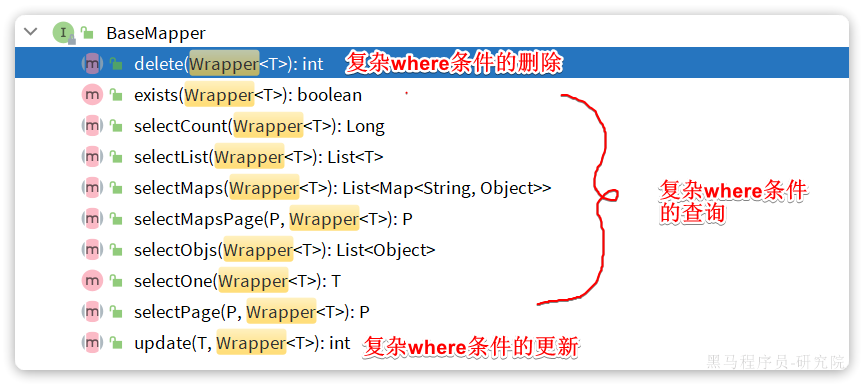

参数中的`Wrapper`就是**条件构造的抽象类**，其下有很多默认实现，继承关系如图：

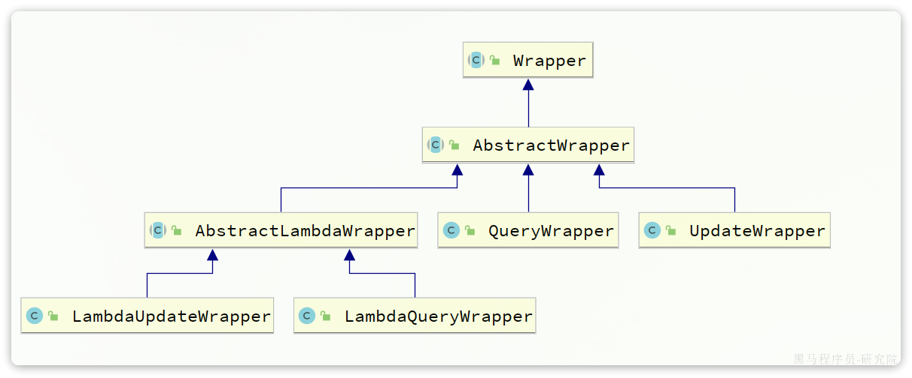

`Wrapper`的子类`AbstractWrapper`**提供了where中包含的所有条件构造**方法：

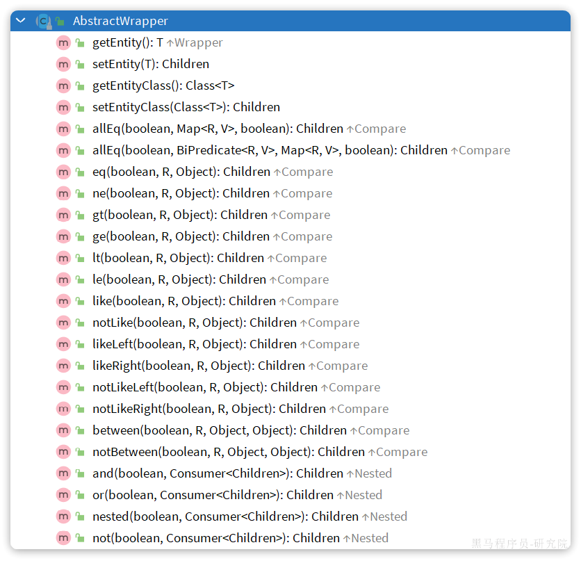

而`QueryWrapper`在AbstractWrapper的基础上拓展了一个select方法，**允许指定查询字段**：

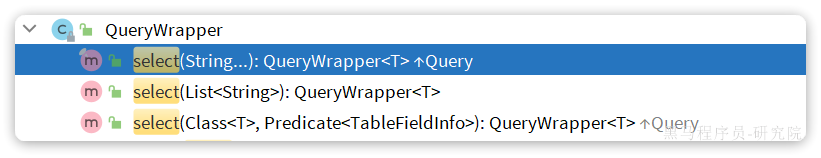

而`UpdateWrappe`在AbstractWrapper的基础上拓展了一个set方法，**允许指定SQL中的SET部分**：


接下来，我们就来看看如何利用`Wrapper`实现复杂查询。

### 2.1.1 QueryWrapper

无论是修改、删除、查询，都可以使用QueryWrapper来**构建查询条件**。接下来看一些例子： 

**查询**：查询出名字中带`o`的，存款大于等于1000元的人。

代码如下：

```Java
@Test
void testQueryWrapper() {
    // 1.构建查询条件 where name like "%o%" AND balance >= 1000
    // select id, username, info, balance from user where name like "%o%" AND balance >= 1000
    QueryWrapper<User> wrapper = new QueryWrapper<User>()
            .select("id", "username", "info", "balance")
            .like("username", "o")
            .ge("balance", 1000);
    // 2.查询数据
    List<User> users = userMapper.selectList(wrapper);
    users.forEach(System.out::println);
}
```

**更新**：更新用户名为jack的用户的余额为2000，代码如下：

```Java
@Test
void testUpdateByQueryWrapper() {
    // 1. 构建查询条件 where name = "Jack"
    QueryWrapper<User> wrapper = new QueryWrapper<User>().eq("username", "Jack");
    // 2. 更新数据，user中非null字段都会作为set语句
    User user = new User();
    user.setBalance(2000);
    // 3. 执行更新
    userMapper.update(user, wrapper);
}
```

### 2.1.2 UpdateWrapper

基于BaseMapper中的update方法更新时只能直接赋值，对于一些复杂的需求就难以实现。 

例如：

**更新**id为`1,2,4`的用户的余额，扣200，对应的SQL应该是：

```sql
UPDATE user SET balance = balance - 200 WHERE id in (1, 2, 4)
```

**SET的赋值结果是基于字段现有值的**，这个时候就要利用UpdateWrapper中的setSql功能了：

```Java
@Test
void testUpdateWrapper() {
    List<Long> ids = List.of(1L, 2L, 4L);
    // 1.生成SQL
    UpdateWrapper<User> wrapper = new UpdateWrapper<User>()
            .setSql("balance = balance - 200") // SET balance = balance - 200
            .in("id", ids); // WHERE id in (1, 2, 4)
        // 2.更新，注意第一个参数可以给null，也就是不填更新字段和数据，
    // 而是基于UpdateWrapper中的setSQL来更新
    userMapper.update(null, wrapper);
}
```

### 2.1.3 LambdaQueryWrapper

无论是QueryWrapper还是UpdateWrapper在构造条件的时候都需要写死字段名称，会出现字符串`魔法值`。这在编程规范中显然是不推荐的。 那怎么样才能不写字段名，又能知道字段名呢？

其中一种办法是基于变量的`gettter`方法结合反射技术。因此我们只要将条件对应的字段的`getter`方法传递给MybatisPlus，它就能计算出对应的变量名了。而传递方法可以使用JDK8中的`方法引用`和`Lambda`表达式。 因此MybatisPlus又提供了一套基于Lambda的Wrapper，包含两个：

- LambdaQueryWrapper
- LambdaUpdateWrapper

分别对应QueryWrapper和UpdateWrapper

其使用方式如下：

查询出名字中带`o`的，存款大于等于1000元的人：

```Java
@Test
void testLambdaQueryWrapper() {
    // 1.构建条件 WHERE username LIKE "%o%" AND balance >= 1000
    // 也可以new LambdaQueryWrapper 就不需要再掉lambda()了
    QueryWrapper<User> wrapper = new QueryWrapper<>();
    wrapper.lambda()
            .select(User::getId, User::getUsername, User::getInfo, User::getBalance)
            .like(User::getUsername, "o")
            .ge(User::getBalance, 1000);
    // 2.查询
    List<User> users = userMapper.selectList(wrapper);
    users.forEach(System.out::println);
}
```

## 2.2 自定义SQL

在演示UpdateWrapper的案例中，我们在代码中编写了更新的SQL语句：

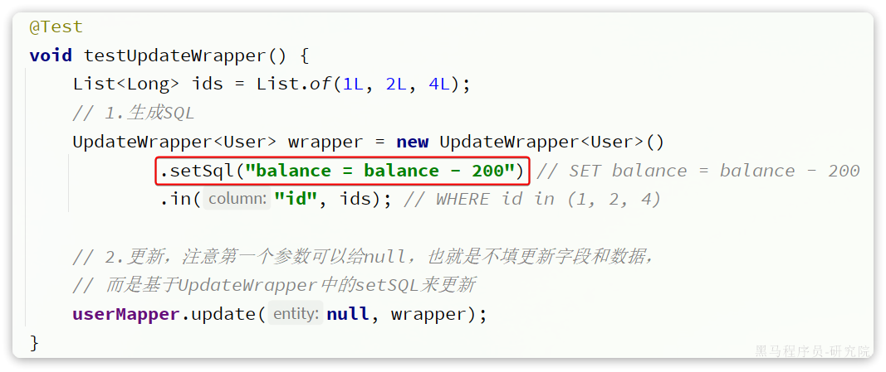

**这种写法在某些企业也是不允许的**，因为SQL语句最好都维护在持久层，而不是业务层。就当前案例来说，由于条件是in语句，只能将SQL写在Mapper.xml文件，利用foreach来生成动态SQL。 这实在是太麻烦了。假如查询条件更复杂，动态SQL的编写也会更加复杂。

所以，**MybatisPlus提供了自定义SQL功能，可以让我们利用Wrapper生成查询条件，再结合Mapper.xml编写SQL**

### 2.2.1 基本用法

更新id为`1,2,4`的用户的余额，扣200，对应的SQL应该是：

```sql
UPDATE user SET balance = balance - 200 WHERE id in (1, 2, 4)
```

步骤：

1. 基于Wrapper构建where条件
   ```java
   List<Long> ids = List.of(1L, 2L, 4L);
   int amount = 200;
   // 1.构建条件
   LambdaQueryWrapper<User> wrapper = new LambdaQueryWrapper<User>().in(User::getId, ids);
   // 2.自定义SQL方法调用
   userMapper.updateBalanceByIds(wrapper, amount);
   ```

2. 在mapper方法参数中用Param注解声明wrapper变量名称，必须是ew。baomidou的`Constants`类里有很多常量，`WRAPPER`就是`ew`

   ```java
   // void updateBalanceByIds(@Param("ew") LambdaQueryWrapper<User> wrapper, @Param("amount") int amount);
   void updateBalanceByIds(@Param(Constants.WRAPPER) LambdaQueryWrapper<User> wrapper, @Param("amount") int amount);
   
   // 或
   // @Select("UPDATE user SET balance = balance - #{money} ${ew.customSqlSegment}")
   // void updateBalanceByIds(@Param("money") int money, @Param("ew") QueryWrapper<User> wrapper);
   ```

3. 自定义SQL，并使用Wrapper条件
   ```xml
   <update id="updateBalanceByIds">
       UPDATE tb_user SET balance = balance - #{amount} ${ew.customSqlSegment}
   </update>
   ```

这样就省去了编写复杂查询条件的烦恼了。

### 2.2.2 多表关联

理论上来讲MyBatisPlus是不支持多表查询的，不过我们可以利用Wrapper中自定义条件结合自定义SQL来实现多表查询的效果。 例如，我们要查询出所有收货地址在北京的并且用户id在1、2、4之中的用户 要是自己基于mybatis实现SQL，大概是这样的：

```XML
<select id="queryUserByIdAndAddr" resultType="com.itheima.mp.domain.po.User">
      SELECT *
      FROM user u
      INNER JOIN address a ON u.id = a.user_id
      WHERE u.id
      <foreach collection="ids" separator="," item="id" open="IN (" close=")">
          #{id}
      </foreach>
      AND a.city = #{city}
  </select>
```

可以看出其中最复杂的就是WHERE条件的编写，如果业务复杂一些，这里的SQL会更变态。

但是基于自定义SQL结合Wrapper的玩法，我们就可以利用Wrapper来构建查询条件，然后手写SELECT及FROM部分，实现多表查询。

查询条件这样来构建：

```Java
@Test
void testCustomJoinWrapper() {
    // 1.准备自定义查询条件
    QueryWrapper<User> wrapper = new QueryWrapper<User>()
            .in("u.id", List.of(1L, 2L, 4L))
            .eq("a.city", "北京");

    // 2.调用mapper的自定义方法
    List<User> users = userMapper.queryUserByWrapper(wrapper);

    users.forEach(System.out::println);
}
```

然后在UserMapper中自定义方法：

```Java
@Select("SELECT u.* FROM user u INNER JOIN address a ON u.id = a.user_id ${ew.customSqlSegment}")
List<User> queryUserByWrapper(@Param("ew")QueryWrapper<User> wrapper);
```

当然，也可以在`UserMapper.xml`中写SQL：

```XML
<select id="queryUserByIdAndAddr" resultType="com.itheima.mp.domain.po.User">
    SELECT * FROM user u INNER JOIN address a ON u.id = a.user_id ${ew.customSqlSegment}
</select>
```

## 2.3 Service接口

MybatisPlus不仅提供了BaseMapper，还提供了通用的Service接口及默认实现，封装了一些常用的service模板方法。 通用接口为`IService`，默认实现为`ServiceImpl`，其中封装的方法可以分为以下几类：

- `save`：新增
- `remove`：删除
- `update`：更新
- `get`：查询单个结果
- `list`：查询集合结果
- `count`：计数
- `page`：分页查询

### 2.3.1 CRUD

我们先俩看下基本的CRUD接口。 

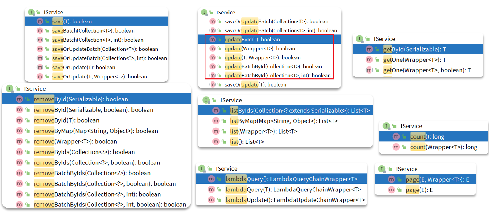

新增：

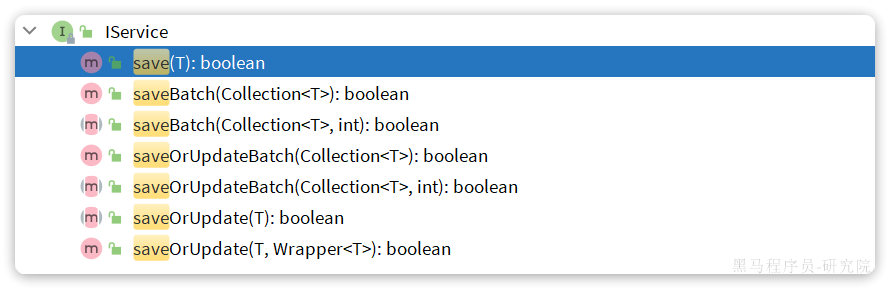

- `save`是新增单个元素
- `saveBatch`是批量新增
- `saveOrUpdate`是根据id判断，如果数据存在就更新，不存在则新增
- `saveOrUpdateBatch`是批量的新增或修改

删除：


- `removeById`：根据id删除
- `removeByIds`：根据id批量删除
- `removeByMap`：根据Map中的键值对为条件删除
- `remove(Wrapper<T>)`：根据Wrapper条件删除
- `~~removeBatchByIds~~`：暂不支持

修改：

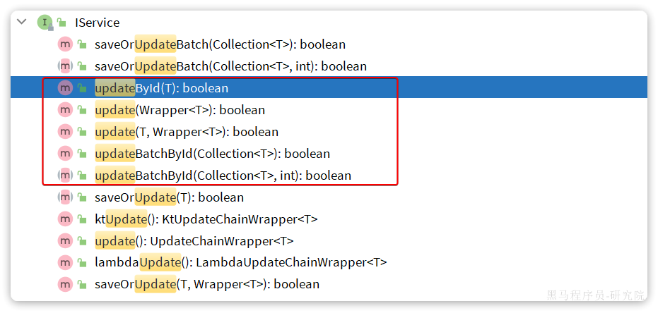

- `updateById`：根据id修改
- `update(Wrapper<T>)`：根据`UpdateWrapper`修改，`Wrapper`中包含`set`和`where`部分
- `update(T，Wrapper<T>)`：按照`T`内的数据修改与`Wrapper`匹配到的数据
- `updateBatchById`：根据id批量修改

Get：


- `getById`：根据id查询1条数据
- `getOne(Wrapper<T>)`：根据`Wrapper`查询1条数据
- `getBaseMapper`：获取`Service`内的`BaseMapper`实现，某些时候需要直接调用`Mapper`内的自定义`SQL`时可以用这个方法获取到`Mapper`

List：


- `listByIds`：根据id批量查询
- `list(Wrapper<T>)`：根据Wrapper条件查询多条数据
- `list()`：查询所有

Count：


- `count()`：统计所有数量
- `count(Wrapper<T>)`：统计符合`Wrapper`条件的数据数量

getBaseMapper： 当我们在service中要调用Mapper中自定义SQL时，就必须获取service对应的Mapper，就可以通过这个方法：

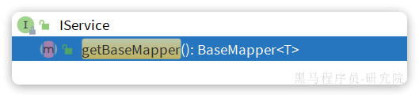

### 2.3.2 基本用法

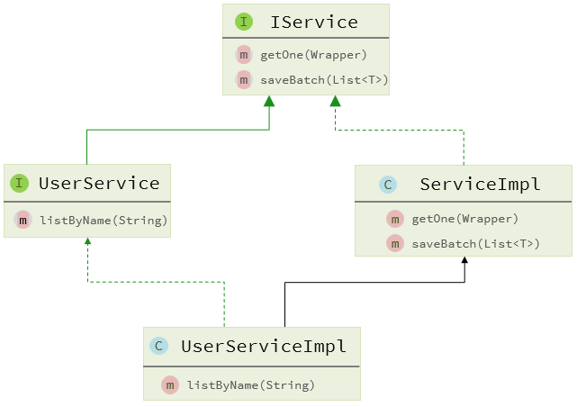

由于`Service`中经常需要定义与业务有关的自定义方法，因此我们不能直接使用`IService`，而是自定义`Service`接口，然后继承`IService`以拓展方法。同时，让自定义的`Service实现类`继承`ServiceImpl`，这样就不用自己实现`IService`中的接口了。

1. **自定义`Service`接口继承`IService`接口**
2. **自定义的`Service实现类`，实现自定义接口并继承`ServiceImpl`类**

即：

首先，定义`IUserService`，继承`IService`：

```Java
public interface IUserService extends IService<User> {
    // 拓展自定义方法
}
```

然后，编写`UserServiceImpl`类，继承`ServiceImpl`，实现`UserService`：

```Java
@Service
public class UserServiceImpl extends ServiceImpl<UserMapper, User> implements IUserService {
}
```

项目结构如下：

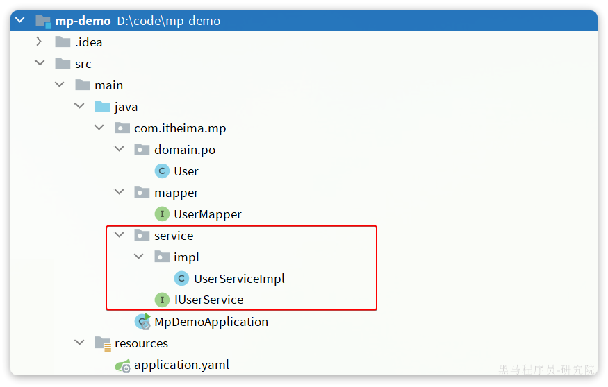

### 2.3.3 案例Rest风格实现

我们快速实现以下5个接口：

| 编号                                     | 接口           | 请求方式 | 请求路径                       | 请求参数             | 返回值     |
| :--------------------------------------- | :------------- | :------- | :----------------------------- | :------------------- | :--------- |
| 1                                        | 新增用户       | POST     | `/users`                       | 用户表单实体         | 无         |
| 2                                        | 删除用户       | DELETE   | `/users/{id}`                  | 用户id               | 无         |
| 3                                        | 根据id查询用户 | GET      | `/users/{id}`                  | 用户id               | 用户VO     |
| 4                                        | 根据id批量查询 | GET      | `/users`                       | 用户id集合           | 用户VO集合 |
| 5<br />(有业务逻辑，需自定义service方法) | 根据id扣减余额 | PUT      | `/user/{id}/dedcution/{money}` | 用户id<br />扣减金额 | 无         |

首先，我们在项目中引入几个依赖：

```XML
<!--swagger 主要用于RESTful API的文档生成和测试。-->
<dependency>
    <groupId>com.github.xiaoymin</groupId>
    <artifactId>knife4j-openapi2-spring-boot-starter</artifactId>
    <version>4.1.0</version>
</dependency>
<!--web-->
<dependency>
    <groupId>org.springframework.boot</groupId>
    <artifactId>spring-boot-starter-web</artifactId>
</dependency>
```

然后需要配置swagger信息：

```YAML
knife4j:
  enable: true
  openapi:
    title: 用户管理接口文档
    description: "用户管理接口文档"
    email: zhanghuyi@itcast.cn
    concat: 虎哥
    url: https://www.itcast.cn
    version: v1.0.0
    group:
      default:
        group-name: default
        api-rule: package
        api-rule-resources:
          - com.itheima.mp.controller
```

然后，接口需要两个实体：

- UserFormDTO：代表新增时的用户表单
- UserVO：代表查询的返回结果

首先是**UserFormDTO：**

```Java
package com.itheima.mp.domain.dto;

import com.baomidou.mybatisplus.annotation.TableField;
import com.baomidou.mybatisplus.extension.handlers.JacksonTypeHandler;
import io.swagger.annotations.ApiModel;
import io.swagger.annotations.ApiModelProperty;
import lombok.Data;

@Data
@ApiModel(description = "用户表单实体")
public class UserFormDTO {

    @ApiModelProperty("id")
    private Long id;

    @ApiModelProperty("用户名")
    private String username;

    @ApiModelProperty("密码")
    private String password;

    @ApiModelProperty("注册手机号")
    private String phone;

    @ApiModelProperty("详细信息，JSON风格")
    private String info;

    @ApiModelProperty("账户余额")
    private Integer balance;
}
```

然后是**UserVO：**

```Java
package com.itheima.mp.domain.vo;

import io.swagger.annotations.ApiModel;
import io.swagger.annotations.ApiModelProperty;
import lombok.Data;

@Data
@ApiModel(description = "用户VO实体")
public class UserVO {
    
    @ApiModelProperty("用户id")
    private Long id;
    
    @ApiModelProperty("用户名")
    private String username;
    
    @ApiModelProperty("详细信息")
    private String info;

    @ApiModelProperty("使用状态（1正常 2冻结）")
    private Integer status;
    
    @ApiModelProperty("账户余额")
    private Integer balance;
}
```

最后，按照Restful风格编写**Controller**接口方法：

```Java
@Api("用户管理接口")
@RequestMapping("/users")
@RestController
@RequiredArgsConstructor // lombok必备参数的构造函数，该构造函数包含所有被 final 修饰的字段，以及所有被 @NonNull 注解修饰的字段
public class UserController {
//    @Autowired // 不推荐使用@Autowired注入，推荐使用构造方法注入
    private final IUserService userService; // 建议使用构造函数注入，可以使用final修饰保证不可变性

    /*
    // @RequiredArgsConstructor注解生成的构造函数
    public UserController(IUserService userService) {
        this.userService = userService;
    }
    */

    @ApiOperation("新增用户接口")
    @PostMapping
    public void saveUser(@RequestBody UserFormDTO userFormDTO) {
        // 1. 把DTO拷贝到PO
        User user = BeanUtil.copyProperties(userFormDTO, User.class);
        // 2. 新增
        userService.save(user); // IService中mp帮我们写好的方法
    }

    @ApiOperation("删除用户接口")
    @DeleteMapping("{id}")
    public void deleteUser(@ApiParam("用户id") @PathVariable("id") Long id) {
        // 删除
        userService.removeById(id); // IService中mp帮我们写好的方法
    }

    @ApiOperation("根据id查询用户接口")
    @GetMapping("{id}")
    public UserVO queryUserById(@ApiParam("用户id") @PathVariable("id") Long id) {
        // 1. 查询用户
        User user = userService.getById(id);// IService中mp帮我们写好的方法
        // 2. 将PO拷贝到VO返回
        return BeanUtil.copyProperties(user, UserVO.class);
    }

    @ApiOperation("根据id批量查询用户接口")
    @GetMapping
    public List<UserVO> queryUserByIds(@ApiParam("用户id集合") @RequestParam("ids") List<Long> ids) {
        // 1. 查询用户
        List<User> users = userService.listByIds(ids);// IService中mp帮我们写好的方法
        // 2. 将PO集合拷贝到VO集合返回
//        List<UserVO> userVOS = BeanUtil.copyToList(users, UserVO.class);
        return BeanUtil.copyToList(users, UserVO.class);
    }
}
```

可以看到上述接口都直接在controller即可实现，无需编写任何service代码，非常方便。

---

不过，**一些带有业务逻辑的接口则需要在service中自定义实现**了。

例如下面的需求：

- **根据id扣减用户余额**

这看起来是个简单修改功能，只要修改用户余额即可。但这个业务包含一些业务逻辑处理：

- 判断用户状态是否正常
- 判断用户余额是否充足

这些业务逻辑都要在service层来做，另外更新余额需要自定义SQL，要在mapper中来实现。因此，我们除了要编写controller以外，具体的业务还要在service和mapper中编写。

首先在UserController中定义一个方法：

```Java
@PutMapping("{id}/deduction/{money}")
@ApiOperation("扣减用户余额")
public void deductBalance(@PathVariable("id") Long id, @PathVariable("money")Integer money){
	userService.deductBalance(id, money);// 有业务逻辑 我们自定义的service方法
}
```

然后是UserService接口：

```Java
package com.itheima.mp.service;

import com.baomidou.mybatisplus.extension.service.IService;
import com.itheima.mp.domain.po.User;

public interface IUserService extends IService<User> {
    void deductBalance(Long id, Integer money);
}
```

最后是UserServiceImpl实现类：

```Java
@Service
public class UserServiceImpl extends ServiceImpl<UserMapper, User> implements IUserService {
       @Override
    public void deductBalance(Long id, Integer money) {
        // 1. 查询用户
        User user = getById(id);
        // 2. 校验用户状态  1:正常 2:冻结
        if (user == null || user.getStatus().equals("2")) {
            throw new RuntimeException("无该用户或用户状态异常！");
        }
        // 3. 校验余额是否充足
        if (user.getBalance() < money) {
            throw new RuntimeException("用户余额不足！");
        }
        // 4. 扣减金额 update tb_user set balance = balance = ?
        baseMapper.deductBalance(id, money); // 自定义的mapper
    }
}
```

最后是mapper：

```Java
@Update("UPDATE user SET balance = balance - #{money} WHERE id = #{id}")
void deductMoneyById(@Param("id") Long id, @Param("money") Integer money);
```

### 2.3.4 Lambda查询

IService中还提供了**Lambda功能来简化我们的复杂查询及更新**功能。我们通过两个案例来学习一下。

#### 2.3.4.1 案例一：实现一个根据复杂条件查询用户的接口

查询条件如下：

- name：用户名关键字，可以为空
- status：用户状态，可以为空
- minBalance：最小余额，可以为空
- maxBalance：最大余额，可以为空

可以理解成一个用户的后台管理界面，**管理员可以自己选择条件来筛选用户，因此上述条件不一定存在，需要做判断。**

mybatis时的xml:

```xml
<select id="queryUsers" resultType="com.itheima.mp.domain.po.User">
    SELECT *
    FROM tb_user
    <where>
        <if test="name != null">
            AND username LIKE #{name}
        </if>
        <if test="status != null">
            AND `status` = #{status}
        </if>
        <if test="minBalance != null and maxBalance != null">
            AND balance BETWEEN #{minBalance} AND #{maxBalance}
        </if>
    </where>
</select>
```

我们首先需要定义一个查询条件实体，UserQuery实体：

```Java
package com.itheima.mp.domain.query;
import io.swagger.annotations.ApiModel;
import io.swagger.annotations.ApiModelProperty;
import lombok.Data;
@Data
@ApiModel(description = "用户查询条件实体")
public class UserQuery {
    @ApiModelProperty("用户名关键字")
    private String name;
    @ApiModelProperty("用户状态：1-正常，2-冻结")
    private Integer status;
    @ApiModelProperty("余额最小值")
    private Integer minBalance;
    @ApiModelProperty("余额最大值")
    private Integer maxBalance;
}
```

接下来我们在UserController中定义一个controller方法(不使用IService.lambda方法时)：

```Java
@GetMapping("/list")
@ApiOperation("根据id集合查询用户")
public List<UserVO> queryUsers(UserQuery query){
    // 1.组织条件
    String username = query.getName();
    Integer status = query.getStatus();
    Integer minBalance = query.getMinBalance();
    Integer maxBalance = query.getMaxBalance();
    LambdaQueryWrapper<User> wrapper = new QueryWrapper<User>().lambda()
            .like(username != null, User::getUsername, username)
            .eq(status != null, User::getStatus, status)
            .ge(minBalance != null, User::getBalance, minBalance)
            .le(maxBalance != null, User::getBalance, maxBalance);
    // 2.查询用户
    List<User> users = userService.list(wrapper);
    // 3.处理vo
    return BeanUtil.copyToList(users, UserVO.class);
}
```

在组织查询条件的时候，我们加入了 `username != null` 这样的参数，意思就是当条件成立时才会添加这个查询条件，类似Mybatis的mapper.xml文件中的`<if>`标签。这样就实现了动态查询条件效果了。

**不过，上述条件构建的代码太麻烦了**。 因此Service中对`LambdaQueryWrapper`和`LambdaUpdateWrapper`的用法进一步做了简化。我们无需自己通过`new`的方式来创建`Wrapper`，而是**直接调用`lambdaQuery`和`lambdaUpdate`方法：**

**基于Lambda查询：**

```Java
@GetMapping("/list")
@ApiOperation("根据id集合查询用户")
public List<UserVO> queryUsers(UserQuery query){
    // 1.组织条件
    String username = query.getName();
    Integer status = query.getStatus();
    Integer minBalance = query.getMinBalance();
    Integer maxBalance = query.getMaxBalance();
    // 2.查询用户
    List<User> users = userService.lambdaQuery()
            .like(username != null, User::getUsername, username)
            .eq(status != null, User::getStatus, status)
            .ge(minBalance != null, User::getBalance, minBalance)
            .le(maxBalance != null, User::getBalance, maxBalance)
            .list();
    // 3.处理vo
    return BeanUtil.copyToList(users, UserVO.class);
}
```

> 只传一个minBalance时：
>
> `SELECT id,username,password,phone,info,status,balance,create_time,update_time FROM tb_user WHERE (balance > ?)`

可以发现lambdaQuery方法中除了可以构建条件，还需要在链式编程的最后添加一个`list()`，这是在告诉MP我们的调用结果需要是一个list集合。这里不仅可以用`list()`，可选的方法有：

- `.one()`：最多1个结果
- `.list()`：返回集合结果
- `.count()`：返回计数结果

MybatisPlus会根据链式编程的最后一个方法来判断最终的返回结果。与lambdaQuery方法类似，IService中的lambdaUpdate方法可以非常方便的实现复杂更新业务。

**例如下面的需求：**

#### 2.3.4.2 案例二

根据id修改用户余额的接口，**如果扣减后余额为0，则将用户status修改为冻结状态（2）**

也就是说我们在扣减用户余额时，需要对用户剩余余额做出判断，如果发现剩余余额为0，则应该将status修改为2，这就是说update语句的set部分是动态的。

实现如下：

```Java
@Override
@Transactional
public void deductBalance(Long id, Integer money) {
    // 1. 查询用户
    User user = getById(id);
    // 2. 校验用户状态  1:正常 2:冻结
    if (user == null || user.getStatus().equals("2")) {
        throw new RuntimeException("无该用户或用户状态异常！");
    }
    // 3. 校验余额是否充足
    if (user.getBalance() < money) {
        throw new RuntimeException("用户余额不足！");
    }
    // 4. 扣减余额，且当扣减后余额为0时修改用户状态为2:冻结，
    int remainBalance = user.getBalance() - money; // 扣减后的余额
    lambdaUpdate()
        .set(User::getBalance, remainBalance)
        .set(remainBalance == 0, User::getStatus, 2) // 动态判断，是否更新status
        .eq(User::getId, id)
        .eq(User::getBalance, user.getBalance()) // 乐观锁 用户余额=刚才查到的余额
        .update();
}
```

### 2.3.5 批量新增

结论：配置文件中修改`&rewriteBatchedStatements=true`，批处理性能会更好

```yaml
spring:
  datasource:
    url: jdbc:mysql://127.0.0.1:3306/mp?useUnicode=true&characterEncoding=UTF-8&autoReconnect=true&serverTimezone=Asia/Shanghai&rewriteBatchedStatements=true
    driver-class-name: com.mysql.cj.jdbc.Driver
    username: root
    password: MySQL123
```

`rewriteBatchedStatements`默认为false

**批量插入10万条用户数据，并作出对比：**

- IService普通for循环插入save(一次插一个 插100000次)，较慢
- IService的批量插入saveBatch(一次插1000个插100次)，较快
- 开启`rewriteBatchedStatements=true`参数saveBatch(一次插1000个插100次)，最快

**批处理方案结论：**

- 普通for循环逐条插入速度极差，不推荐
- MP的批量新增，基于预编译的批处理，性能不错
- 配置jdbc参数，开`rewriteBatchedStatements`，性能最好

**测试过程：**

IService中的批量新增功能使用起来非常方便，但有一点注意事项，我们先来测试一下。 

首先我们**测试逐条插入数据**：

```Java
@Test
void testSaveOneByOne() {
    long b = System.currentTimeMillis();
    for (int i = 1; i <= 100000; i++) {
        userService.save(buildUser(i));
    }
    long e = System.currentTimeMillis();
    System.out.println("耗时：" + (e - b));
}

private User buildUser(int i) {
    User user = new User();
    user.setUsername("user_" + i);
    user.setPassword("123");
    user.setPhone("" + (18688190000L + i));
    user.setBalance(2000);
    user.setInfo("{\"age\": 24, \"intro\": \"英文老师\", \"gender\": \"female\"}");
    user.setCreateTime(LocalDateTime.now());
    user.setUpdateTime(user.getCreateTime());
    return user;
}
```

执行结果如下：


可以看到**速度非常慢。**

然后**再试试MybatisPlus的批处理**：

一次插入1000条

```Java
@Test
void testSaveBatch() {
    // 准备10万条数据
    List<User> list = new ArrayList<>(1000);
    long b = System.currentTimeMillis();
    for (int i = 1; i <= 100000; i++) {
        list.add(buildUser(i));
        // 每1000条批量插入一次
        if (i % 1000 == 0) {
            userService.saveBatch(list);
            list.clear();
        }
    }
    long e = System.currentTimeMillis();
    System.out.println("耗时：" + (e - b));
}
```

执行最终耗时如下：


可以看到使用了批处理以后，比逐条新增效率提高了10倍左右，**性能还是不错的。**

不过，我们简单查看一下`MybatisPlus`源码：

```Java
@Transactional(rollbackFor = Exception.class)
@Override
public boolean saveBatch(Collection<T> entityList, int batchSize) {
    String sqlStatement = getSqlStatement(SqlMethod.INSERT_ONE);
    return executeBatch(entityList, batchSize, (sqlSession, entity) -> sqlSession.insert(sqlStatement, entity));
}
// ...SqlHelper
public static <E> boolean executeBatch(Class<?> entityClass, Log log, Collection<E> list, int batchSize, BiConsumer<SqlSession, E> consumer) {
    Assert.isFalse(batchSize < 1, "batchSize must not be less than one");
    return !CollectionUtils.isEmpty(list) && executeBatch(entityClass, log, sqlSession -> {
        int size = list.size();
        int idxLimit = Math.min(batchSize, size);
        int i = 1;
        for (E element : list) {
            consumer.accept(sqlSession, element);
            if (i == idxLimit) {
                sqlSession.flushStatements();
                idxLimit = Math.min(idxLimit + batchSize, size);
            }
            i++;
        }
    });
}
```

可以发现其实`MybatisPlus`的批处理是基于`PrepareStatement`的预编译模式，然后批量提交，最终在数据库执行时还是会有多条insert语句，逐条插入数据。SQL类似这样：

```SQL
Preparing: INSERT INTO user ( username, password, phone, info, balance, create_time, update_time ) VALUES ( ?, ?, ?, ?, ?, ?, ? )
Parameters: user_1, 123, 18688190001, "", 2000, 2023-07-01, 2023-07-01
Parameters: user_2, 123, 18688190002, "", 2000, 2023-07-01, 2023-07-01
Parameters: user_3, 123, 18688190003, "", 2000, 2023-07-01, 2023-07-01
```

**而如果想要得到最佳性能，最好是将多条SQL合并为一条，像这样：**

```SQL
INSERT INTO user ( username, password, phone, info, balance, create_time, update_time )
VALUES 
(user_1, 123, 18688190001, "", 2000, 2023-07-01, 2023-07-01),
(user_2, 123, 18688190002, "", 2000, 2023-07-01, 2023-07-01),
(user_3, 123, 18688190003, "", 2000, 2023-07-01, 2023-07-01),
(user_4, 123, 18688190004, "", 2000, 2023-07-01, 2023-07-01);
```

**该怎么做呢？**

MySQL的客户端连接参数中有这样的一个**参数：`rewriteBatchedStatements`**。顾名思义，就是重写批处理的`statement`语句。参考文档：

https://dev.mysql.com/doc/connector-j/8.0/en/connector-j-connp-props-performance-extensions.html#cj-conn-prop_rewriteBatchedStatements

**这个参数的默认值是false，我们需要修改连接参数，将其配置为true**

**修改项目中的application.yml文件，在jdbc的url后面添加参数`&rewriteBatchedStatements=true`:**

```YAML
spring:
  datasource:
    url: jdbc:mysql://127.0.0.1:3306/mp?useUnicode=true&characterEncoding=UTF-8&autoReconnect=true&serverTimezone=Asia/Shanghai&rewriteBatchedStatements=true
    driver-class-name: com.mysql.cj.jdbc.Driver
    username: root
    password: MySQL123
```

再次测试插入10万条数据，可以发现速度有非常明显的提升：

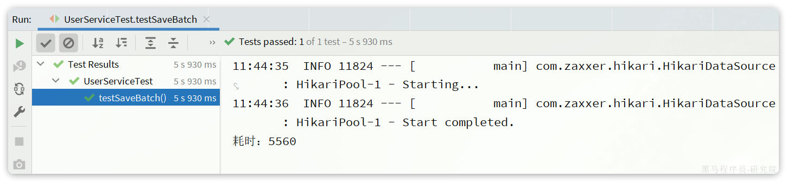

在`ClientPreparedStatement`的`executeBatchInternal`中，有判断`rewriteBatchedStatements`值是否为true并重写SQL的功能：

最终，SQL被重写了：

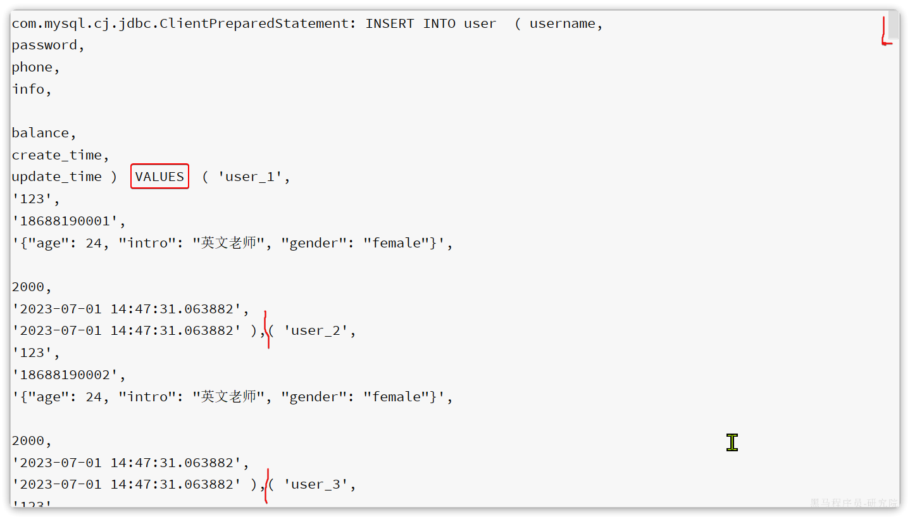

# 3.扩展功能

## 3.1.代码生成

在使用MybatisPlus以后，基础的`Mapper`、`Service`、`PO`代码相对固定，重复编写也比较麻烦。因此MybatisPlus官方提供了代码生成器根据数据库表结构生成`PO`、`Mapper`、`Service`等相关代码。只不过代码生成器同样要编码使用，也很麻烦。

[代码生成器 | MyBatis-Plus](https://www.baomidou.com/guides/new-code-generator/)

[Mybatis X 插件 | MyBatis-Plus](https://www.baomidou.com/guides/mybatis-x/)

<iframe src="https://www.baomidou.com/guides/new-code-generator/" width="100%" height="500px"></iframe>

这里我们不使用官方的，推荐大家使用一款`MybatisPlus`的插件，它可以基于图形化界面完成`MybatisPlus`的代码生成，非常简单。

### 3.1.1 安装插件

在`Idea`的plugins市场中搜索并安装`MyBatisPlus`插件：


然后重启你的Idea即可使用。

### 3.1.2 使用

刚好数据库中还有一张address表尚未生成对应的实体和mapper等基础代码。我们利用插件生成一下。 首先需要配置数据库地址，在Idea顶部菜单中，找到`other`，选择`Config Database`配置数据库表：


新版的idea在Tools里，找不到就直接搜`Config Database`

在弹出的窗口中填写数据库连接的基本信息：


点击OK保存。

然后再次点击Idea顶部菜单中的other，然后选择`Code Generator`代码生成器:


在弹出的表单中填写信息：


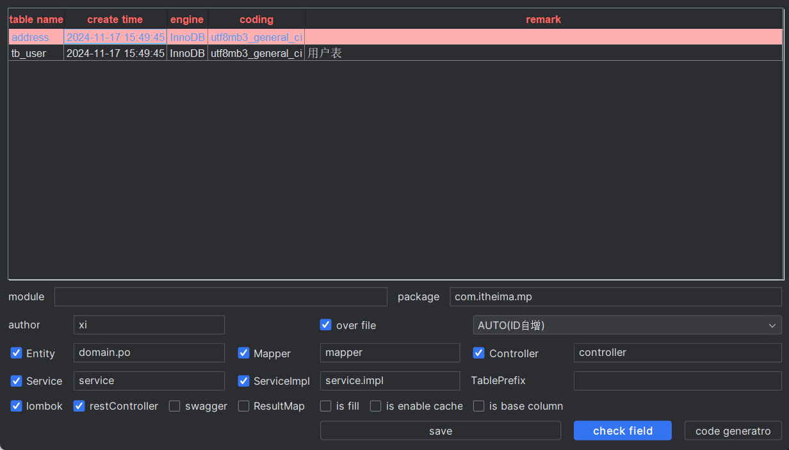

`over file`：是否覆盖文件

最终，代码自动生成到指定的位置了：

## 3.2 静态工具

### 3.2.1 静态工具api

有的时候Service之间也会相互调用，为了避免出现循环依赖问题，MybatisPlus提供一个**静态工具类：`Db`**，其中的一些静态方法**与`IService`中方法签名基本一致**，也可以帮助我们实现CRUD功能：


静态工具与IService接口的差别就是需要额外传一个参数，也就是IService的泛型

除了`save...` 和 `update...`方法不用传该参数其他都需要

示例：

```Java
@Test
void testDbGet() {
    User user = Db.getById(1L, User.class);
    System.out.println(user);
}

@Test
void testDbList() {
    // 利用Db实现复杂条件查询
    List<User> list = Db.lambdaQuery(User.class)
            .like(User::getUsername, "o")
            .ge(User::getBalance, 1000)
            .list();
    list.forEach(System.out::println);
}

@Test
void testDbUpdate() {
    Db.lambdaUpdate(User.class)
            .set(User::getBalance, 2000)
            .eq(User::getUsername, "Rose");
}
```

### 3.2.2 静态工具案例

**情景**：业务需要操作多个表，如果在service中注入其他service会造成循环依赖，这时候我们就需要使用静态工具类避免循环依赖。

有循环依赖尽量避免

需求：

- 案例一：改造根据id查询用户的接口，查询用户的同时，查询出用户对应的所有地址
- 案例二：改造根据id批量查询用户的接口，查询用户的同时，查询出用户对应的所有地址
- ~~案例三：实现根据用户id查询收货地址功能，需要验证用户状态，冻结用户抛出异常（练习）~~

#### 3.2.2.1  静态工具案例一

**需求：改造根据id用户查询的接口，查询用户的同时返回用户收货地址列表**

**首先，我们要添加一个收货地址的`VO`对象：**

```Java
@Data
@ApiModel(description = "收货地址VO")
public class AddressVO{

    @ApiModelProperty("id")
    private Long id;

    @ApiModelProperty("用户ID")
    private Long userId;

    @ApiModelProperty("省")
    private String province;

    @ApiModelProperty("市")
    private String city;

    @ApiModelProperty("县/区")
    private String town;

    @ApiModelProperty("手机")
    private String mobile;

    @ApiModelProperty("详细地址")
    private String street;

    @ApiModelProperty("联系人")
    private String contact;

    @ApiModelProperty("是否是默认 1默认 0否")
    private Boolean isDefault;

    @ApiModelProperty("备注")
    private String notes;
}
```

然后，改造原来的`UserVO`，添加一个地址属性：


接下来，修改`UserController`中根据id查询用户的业务接口：

```Java
@GetMapping("/{id}")
@ApiOperation("根据id查询用户")
public UserVO queryUserById(@PathVariable("id") Long userId){
     /* // 修改前 不返回用户收货地址时 单表查询
        // 1. 查询用户
        User user = userService.getById(id);// IService中mp帮我们写好的方法

        // 2. 将PO拷贝到VO返回
        return BeanUtil.copyProperties(user, UserVO.class);
     */

    // 基于自定义service方法查询  修改后 返回收货地址 业务操作多个表
    return userService.queryUserAndAddressById(userId);
}
```

由于查询业务复杂，所以要在service层来实现。首先在IUserService中定义方法：

```Java
public interface IUserService extends IService<User> {
    UserVO queryUserAndAddressById(Long userId);
}
```

然后，在`UserServiceImpl`中实现该方法：

```Java
@Override
public UserVO queryUserAddressById(Long id) {
    // 1. 查询用户
    User user = getById(id);
    if (user == null || user.getStatus() == 2) {
        throw new RuntimeException("用户状态异常!");
    }

    // 2. 查询地址 使用Db静态工具类 防止出现循环依赖(注入其他Service，如AddressService)
    List<Address> addresses = Db.lambdaQuery(Address.class)
        .eq(Address::getUserId, id).list();

    // 3. 封装VO
    UserVO userVO = BeanUtil.copyProperties(user, UserVO.class);
    if (CollUtil.isNotEmpty(addresses)) {
        userVO.setAddress(BeanUtil.copyToList(addresses, AddressVO.class));
    }
    return userVO;
}
```

在查询地址时，我们采用了Db的静态方法，因此避免了注入AddressService，减少了循环依赖的风险。

#### 3.2.2.2 静态工具案例二

**案例：根据id批量查询用户，并查询出用户对应的所有地址**

`UserController`

```java
@ApiOperation("根据id批量查询用户接口")
@GetMapping
public List<UserVO> queryUserByIds(@ApiParam("用户id集合") @RequestParam("ids") List<Long> ids) {
    /* // 不查地址，只查用户表
        // 1. 查询用户
        List<User> users = userService.listByIds(ids);// IService中mp帮我们写好的方法
        // 2. 将PO集合拷贝到VO集合返回
//        List<UserVO> userVOS = BeanUtil.copyToList(users, UserVO.class);
        return BeanUtil.copyToList(users, UserVO.class);
   */

    // 根据id批量查询用户，并查询出用户对应的所有地址
    return userService.queryUserAndAddressByIds(ids);
}
```

`IUserService`

```java
List<UserVO> queryUserAndAddressByIds(List<Long> ids);
```

`IUserServiceImpl`

```java
/**
 * 根据id批量查询用户，并查询出用户对应的所有地址
 * @param ids
 * @return
 */
@Override
public List<UserVO> queryUserAndAddressByIds(List<Long> ids) {
    // 1. 查询用户
    List<User> users = listByIds(ids);
    if (CollUtil.isEmpty(users)) {
        // List<Object> objects = Collections.emptyList();
        return Collections.emptyList(); // 返回空集合
    }

    // 2. 查询地址
    // 2.1 获取用户id集合
    List<Long> userIds = users.stream().map(User::getId).collect(Collectors.toList());
    // 2.2 根据用户id查询地址
    List<Address> addresses = Db.lambdaQuery(Address.class)
        .in(Address::getUserId, userIds)
        .list();
    // 2.3 转换地址VO
    List<AddressVO> addressVOList = BeanUtil.copyToList(addresses, AddressVO.class);
    // 2.4 梳理地址集合，分类整理，相同用户的地址放在同一个集合中
    // 键为用户id list为该用户的地址集合
    Map<Long, List<AddressVO>> addressMap = new LinkedHashMap<>(0);
    if (CollUtil.isNotEmpty(addressVOList)) { // 如果不为空
        // 根据ID分组
        addressMap = addressVOList.stream()
            .collect(groupingBy(AddressVO::getUserId));
    }

    // 3. 转换VO返回
    List<UserVO> list = new ArrayList<>(users.size());
    for (User user : users) {
        // 3.1 转换user的PO为VO
        UserVO userVO = BeanUtil.copyProperties(user, UserVO.class);
        list.add(userVO);
        // 3.2 转换地址VO
        userVO.setAddress(addressMap.get(user.getId()));
    }
    return list;
}
```

## 3.3.逻辑删除

**逻辑删除**就是基于代码逻辑模拟删除效果，但并不会真正删除数据。思路如下：

- 在表中**添加一个字段标记数据是否被删除**
- 当**删除数据时**把标记置为1
- **查询时**只查询标记为0的数据

例如逻辑删除字段为deleted

- 删除操作
  ```sql
  UPDATE user SET deleted = 1 WHERE id = 1 AND deleted = 0
  ```

- 查询操作
  ```sql
  SELECT * FROM user WHERE deleted = 0
  ```

一旦采用了逻辑删除，所有的查询和删除逻辑都要跟着变化，非常麻烦。

为了解决这个问题，**MybatisPlus就添加了对逻辑删除的支持**。

**注意，只有MybatisPlus生成的SQL语句才支持自动的逻辑删除，自定义SQL需要自己手动处理逻辑删除。**

例如，我们给`address`表添加一个逻辑删除字段：

```SQL
alter table address add deleted bit default b'0' null comment '逻辑删除';
```

然后给`Address`实体添加`deleted`字段：


接下来，我们要**在`application.yml`中配置逻辑删除字段**：

```YAML
mybatis-plus:
  global-config:
    db-config:
      logic-delete-field: deleted # 全局逻辑删除的实体字段名(since 3.3.0,配置后可以忽略不配置步骤2)
      logic-delete-value: 1 # 逻辑已删除值(默认为 1)
      logic-not-delete-value: 0 # 逻辑未删除值(默认为 0)
```

测试： 

```Java
@Test
void testLogicDelete() {
    // 方法与普通删除一模一样，但是底层的SQL逻辑变了
    // 删除
    addressService.removeById(59L);
    // 查询
    Address address = addressService.getById(59L);
    System.out.println("address = " + address);
}
```

方法与普通删除一模一样，但是底层的SQL逻辑变了：

```shell
==>  Preparing: UPDATE address SET deleted=1 WHERE id=? AND deleted=0
==> Parameters: 59(Long)
<==    Updates: 1
==>  Preparing: SELECT id,user_id,province,city,town,mobile,street,contact,is_default,notes,deleted FROM address WHERE id=? AND deleted=0
==> Parameters: 60(Long)
<==      Total: 1

==>  Preparing: SELECT id,user_id,province,city,town,mobile,street,contact,is_default,notes,deleted FROM address WHERE id=? AND deleted=0
==> Parameters: 59(Long)
<==      Total: 0
address = null
```

会发现id为59的确实没有查询出来，而且SQL中也对逻辑删除字段做了判断：

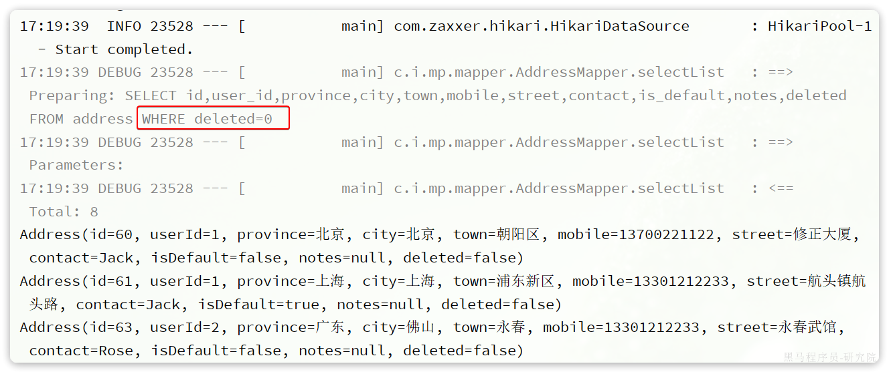

综上， **开启了逻辑删除功能以后，我们就可以像普通删除一样做CRUD**，基本不用考虑代码逻辑问题。还是非常方便的。

**注意**： 逻辑删除本身也有自己的问题，比如：

- 会导致数据库表垃圾数据越来越多，从而影响查询效率
- SQL中全都需要对逻辑删除字段做判断，影响查询效率

因此，我不太推荐采用逻辑删除功能，如果数据不能删除，可以采用把数据迁移到其它表的办法。

## 3.3.枚举处理器

 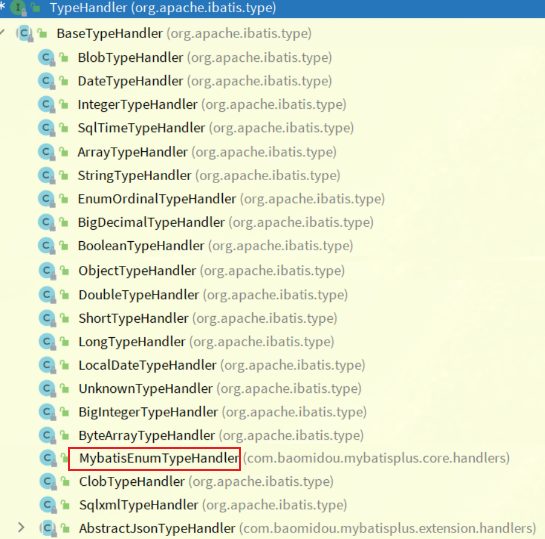

User类中有一个用户状态字段：

```java
/**
 * 使用状态（1正常 2冻结）
 */
private Integer status;
// private UserStatus status; // UserStatus为自定义的用户状态枚举类
```

像这种字段我们一般会定义一个枚举`private UserStatus status`，做业务判断的时候就可以直接基于枚举做比较。但是我们数据库采用的是`int`类型，对应的PO也是`Integer`。因此业务操作时必须手动把枚举`UserStatus` 与`Integer`转换，非常麻烦。

因此，MybatisPlus提供了一个处理枚举的类型转换器，可以帮我们把枚举类型与数据库类型自动转换。

### 3.3.0 枚举处理器使用步骤

1. 给枚举中的与数据库对应value值添加@EnumValue注解
   ```java
   NORMAL(1, "正常"),
   FROZEN(2, "冻结"),
   ;
   // 枚举类的属性
   @EnumValue // 标记枚举中的哪个字段的值作为数据库值 即1或2
   private final int value;
   // 标记JSON序列化时展示的字段
   // 如果不加@JsonValue前端查到的数据则为"NORMAL"或"FROZEN"
   @JsonValue // 我们返回给前端值时SpringMvc的jackson包来处理json 加上该注解，返回给前端该类时只返回该属性，即"正常"或"冻结"
   private final String desc;
   ```

2. 在配置文件中配置统一的枚举处理器，实现类型转换
   ```yaml
   mybatis-plus:
     configuration:
       default-enum-type-handler: com.baomidou.mybatisplus.core.handlers.MybatisEnumTypeHandler # 配置枚举处理器
   ```

### 3.3.1.定义枚举

我们定义一个用户状态的枚举：

 

代码如下：

```Java
import com.baomidou.mybatisplus.annotation.EnumValue;

@Getter
public enum UserStatus {
    NORMAL(1, "正常"),
    FREEZE(2, "冻结")
    ;
    private final int value;
    private final String desc;

    UserStatus(int value, String desc) {
        this.value = value;
        this.desc = desc;
    }
}
```

然后把`User`类中的`status`字段改为`UserStatus` 类型：

```java
/**
 * 使用状态（1正常 2冻结）
 */
private UserStatus status;
```

要让`MybatisPlus`处理枚举与数据库类型自动转换，我们**必须告诉`MybatisPlus`，枚举中的哪个字段的值作为数据库值**。 `MybatisPlus`提供了**`@EnumValue`注解来标记枚举属性**：

```java
@Getter
public enum UserStatus {
    NORMAL(1, "正常"),
    FROZEN(2, "冻结"),
    ;

    @EnumValue // 标记枚举中的哪个字段的值作为数据库值
    private final int value;
    // 标记JSON序列化时展示的字段 即1或2
    // 如果不加@JsonValue前端查到的数据则为"NORMAL"或"FROZEN"
    @JsonValue // 我们返回给前端值时SpringMvc的jackson包来处理json 加上该注解，返回给前端该类时只返回该属性 即"正常"或"冻结"
    private final String desc;
    UserStatus(int value, String desc) {
        this.value = value;
        this.desc = desc;
    }
}
```

### 3.3.2.配置枚举处理器

在`application.yaml`文件中添加配置：

```YAML
mybatis-plus:
  configuration:
    default-enum-type-handler: com.baomidou.mybatisplus.core.handlers.MybatisEnumTypeHandler
```

### 3.3.3.测试

```Java
@Test
void testService() {
    List<User> list = userService.list();
    list.forEach(System.out::println);
}
```

最终，查询出的`User`类的`status`字段会是枚举类型：

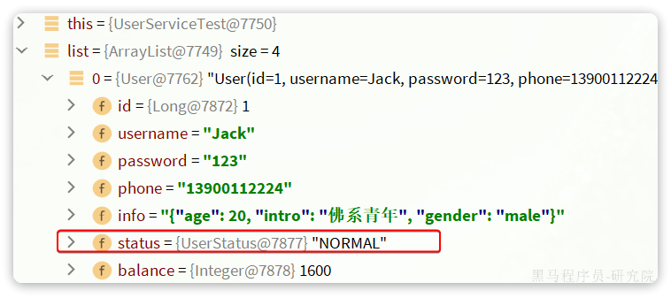

同时，为了使页面查询结果也是枚举格式，我们需要修改UserVO中的status属性：

```java
@ApiModelProperty("使用状态（1正常 2冻结）")
//    private Integer status;
private UserStatus status;
```

并且，在UserStatus枚举中通过`@JsonValue`注解标记JSON序列化时展示的字段：

```java
@JsonValue // 我们返回给前端值时SpringMvc的jackson包来处理json 加上该注解，返回给前端该类时只返回该属性，即"正常"或"冻结"
private final String desc;
```

最后，在页面查询，结果如下：


## 3.4.JSON类型处理器

 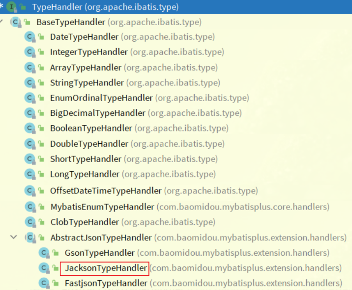

数据库的user表中有一个`info`字段，是JSON类型：

 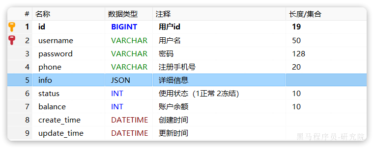

格式像这样：

```JSON
{"age": 20, "intro": "佛系青年", "gender": "male"}
```

而目前`User`实体类中却是`String`类型：

```java
/**
 * 详细信息
 */
private String info;
```

这样一来，我们要读取info中的属性时就非常不方便。如果要方便获取，info的类型最好是一个`Map`或者实体类。

而一旦我们把`info`改为`对象`类型，就需要在写入数据库时手动转为`String`，再读取数据库时，手动转换为`对象`，这会非常麻烦。

因此MybatisPlus提供了很多特殊类型字段的类型处理器，解决特殊字段类型与数据库类型转换的问题。例如处理JSON就可以使用`JacksonTypeHandler`处理器。

接下来，我们就来看看这个处理器该如何使用。

**步骤图示：**

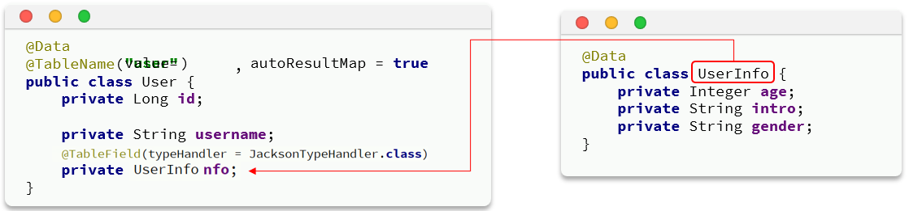

### 3.4.1.定义实体

首先，我们定义一个单独实体类来与info字段的属性匹配：

 

代码如下：

```Java
@Data
public class UserInfo {
    private Integer age;
    private String intro;
    private String gender;
}
```

### 3.4.2.使用类型处理器

接下来，将User类的info字段修改为UserInfo类型，并声明类型处理器`@TableField(typeHandler =  ?`：

```java
@Data
@TableName(value = "tb_user", autoResultMap = true) // 因为该类内部有一个json处理器处理的字段，属于较复杂的，需要开启自动结果映射，autoResultMap = true
public class User {
    // 注册手机号
    private String phone;
    // 详细信息 数据库中是json类型
    @TableField(typeHandler = JacksonTypeHandler.class) // 开启json类型处理器
    private UserInfo info;
    ...
}
```

测试可以发现，所有数据都正确封装到UserInfo当中了：


同时，为了让页面返回的结果也以对象格式返回，我们要修改UserVO中的info字段：

```java
@ApiModelProperty("详细信息")
//    private String info;
private UserInfo info;
```

此时，在页面查询结果如下：


## 3.5.配置加密（选学）

目前我们配置文件中的很多参数都是明文，如果开发人员发生流动，很容易导致敏感信息的泄露。所以MybatisPlus支持配置文件的加密和解密功能。

我们以数据库的用户名和密码为例。

### 3.5.1.生成秘钥

首先，我们利用AES工具生成一个随机秘钥，然后对用户名、密码加密：

```Java
package com.itheima.mp;

import com.baomidou.mybatisplus.core.toolkit.AES;
import org.junit.jupiter.api.Test;

class MpDemoApplicationTests {
    @Test
    void contextLoads() {
        // 生成 16 位随机 AES 密钥
        String randomKey = AES.generateRandomKey();
        System.out.println("randomKey = " + randomKey);

        // 利用密钥对用户名加密
        String username = AES.encrypt("root", randomKey);
        System.out.println("username = " + username);

        // 利用密钥对用户名加密
        String password = AES.encrypt("MySQL123", randomKey);
        System.out.println("password = " + password);

    }
}
```

打印结果如下：

```SQL
randomKey = 6234633a66fb399f
username = px2bAbnUfiY8K/IgsKvscg==
password = FGvCSEaOuga3ulDAsxw68Q==
```

### 3.5.2.修改配置

修改application.yaml文件，把jdbc的用户名、密码修改为刚刚加密生成的密文：

```YAML
spring:
  datasource:
    url: jdbc:mysql://127.0.0.1:3306/mp?useUnicode=true&characterEncoding=UTF-8&autoReconnect=true&serverTimezone=Asia/Shanghai&rewriteBatchedStatements=true
    driver-class-name: com.mysql.cj.jdbc.Driver
    username: mpw:QWWVnk1Oal3258x5rVhaeQ== # 密文要以 mpw:开头
    password: mpw:EUFmeH3cNAzdRGdOQcabWg== # 密文要以 mpw:开头
```

### 3.5.3.测试

在启动项目的时候，需要把刚才生成的秘钥添加到启动参数中，像这样：

--mpw.key=6234633a66fb399f

单元测试的时候不能添加启动参数，所以要在测试类的注解上配置：


然后随意运行一个单元测试，可以发现数据库查询正常。

# 4. 插件功能

 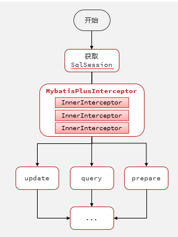

MyBatisPlus基于MyBatis的Interceptor实现了一个基础拦截器，并在内部保存了MyBatisPlus的内置拦截器的集合：

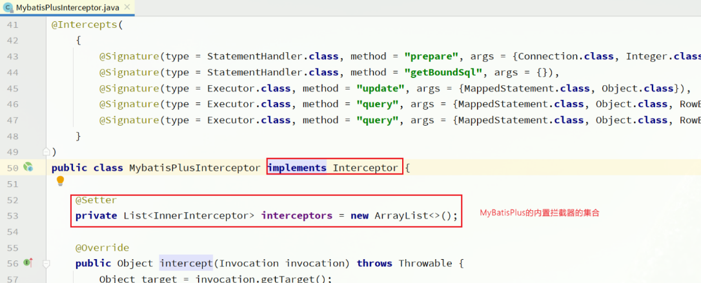

MybatisPlus提供了很多的插件功能，进一步拓展其功能。目前已有的插件有：

- `PaginationInnerInterceptor`：**自动分页**
- `TenantLineInnerInterceptor`：多租户
- `DynamicTableNameInnerInterceptor`：动态表名
- `OptimisticLockerInnerInterceptor`：乐观锁
- `IllegalSQLInnerInterceptor`：sql 性能规范
- `BlockAttackInnerInterceptor`：防止全表更新与删除

注意： 使用多个分页插件的时候需要注意插件定义顺序，建议使用顺序如下：

- 多租户,动态表名
- 分页,乐观锁
- sql 性能规范,防止全表更新与删除

这里我们以分页插件为里来学习插件的用法。

## 4.1.分页插件

在未引入分页插件的情况下，`MybatisPlus`是不支持分页功能的，`IService`和`BaseMapper`中的分页方法都无法正常起效。 所以，我们必须配置分页插件。

### 4.1.1.配置分页插件

在项目中新建一个配置类：


其代码如下：

```Java
@Configuration
public class MyBatisConfig {
    @Bean
    public MybatisPlusInterceptor mybatisPlusInterceptor() {
        // 1. 定义核心插件，没有功能，仅起到拦截作用
        MybatisPlusInterceptor interceptor = new MybatisPlusInterceptor();
        // 2. 创建分页插件
        PaginationInnerInterceptor paginationInnerInterceptor = new PaginationInnerInterceptor(DbType.MYSQL);
        // 一些分页插件的配置(还有其他的配置)
        paginationInnerInterceptor.setMaxLimit(1000L); // 最大一次查询1000条

        // 3. 向核心插件添加分页插件
        interceptor.addInnerInterceptor(paginationInnerInterceptor);
        return interceptor;
    }
}
```

### 4.1.2.分页API

编写一个分页查询的测试：

```Java
@Test
void testPageQuery() {
    int pageNo = 1, pageSize = 2; // 第一页，一页查2条
    // 1. 准备分页条件
    // 1.1 分页条件
    Page<User> page = Page.of(pageNo, pageSize);
    // 1.2 排序条件
    page.addOrder(new OrderItem("balance", false)); // false代表降序
    page.addOrder(new OrderItem("id", true)); // order可以添加多个 如果balance相等根据id升序排
    // 2. 分页查询
    Page<User> p = userService.page(page);
    // 3. 解析
    System.out.println("JSONUtil.toJsonStr(p) = " + JSONUtil.toJsonStr(p));
    long total = p.getTotal(); // 查询到的总条数
    System.out.println("total = " + total);
    long pages = p.getPages(); // 查询到的总页数
    System.out.println("pages = " + pages);
    List<User> users = p.getRecords();
    users.forEach(System.out::println);
}
```

控制台：

```shell
 ==>  Preparing: SELECT COUNT(*) AS total FROM tb_user
 ==> Parameters: 
 <==      Total: 1
 ==>  Preparing: SELECT id, username, password, phone, info, status, balance, create_time, update_time FROM tb_user ORDER BY balance DESC, id ASC LIMIT ?
 ==> Parameters: 2(Long)
 <==      Total: 2
 
 JSONUtil.toJsonStr(p) = {"records":[{"id":3,"username":"Hope","password":"123","phone":"13900112222","info":{"age":25,"intro":"上进青年","gender":"male"},"status":"NORMAL","balance":100000,"createTime":1687185464000,"updateTime":1687185464000},{"id":1,"username":"Jack","password":"123","phone":"13900112224","info":{"age":20,"intro":"佛系青年","gender":"male"},"status":"NORMAL","balance":1580,"createTime":1684500621000,"updateTime":1731926302000}],"total":5,"size":2,"current":1,"orders":[{"column":"balance","asc":false},{"column":"id","asc":true}],"optimizeCountSql":true,"searchCount":true}
total = 5
pages = 3
User(id=3, username=Hope, password=123, phone=13900112222, info=UserInfo(age=25, intro=上进青年, gender=male), status=NORMAL, balance=100000, createTime=2023-06-19T22:37:44, updateTime=2023-06-19T22:37:44)
User(id=1, username=Jack, password=123, phone=13900112224, info=UserInfo(age=20, intro=佛系青年, gender=male), status=NORMAL, balance=1580, createTime=2023-05-19T20:50:21, updateTime=2024-11-18T18:38:22)
```

这里用到了分页参数，Page，即可以支持分页参数，也可以支持排序参数。常见的API如下：

```Java
int pageNo = 1, pageSize = 5;
// 分页参数
Page<User> page = Page.of(pageNo, pageSize);
// 排序参数, 通过OrderItem来指定
page.addOrder(new OrderItem("balance", false));
userService.page(page);
```

## 4.2.案例-通用分页实体

现在要实现一个用户分页查询的接口，接口规范如下：

| 参数     | 说明                                                         |
| -------- | ------------------------------------------------------------ |
| 请求方式 | GET                                                          |
| 请求路径 | /users/page                                                  |
| 请求参数 | `{"pageNo": 1,"pageSize": 5,"sortBy": "balance","isAsc": false,"name": "jock", "status": 1 }` |
| 返回值   | `{"total": 100006, "pages": 50003, "list": [{ "id": 1685100878975279298, "username": "user_9", "info": {"age": 24, "intro": "英文老师", "gender": "female"            }, "status": "正常", "balance": 2000 }]}` |
| 特殊说明 | 如果排序字段为空，默认按照更新时间排序<br />排序字段不为空，则按照排序字段排序 |

这里需要定义3个实体：

- `UserQuery`：分页查询条件的实体，包含分页、排序参数、过滤条件
- `PageDTO`：分页结果实体，包含总条数、总页数、当前页数据
- `UserVO`：用户页面视图实体

### 4.2.1.实体

由于UserQuery之前已经定义过了，并且其中已经包含了过滤条件，具体代码如下：

```Java
@Data
@ApiModel(description = "用户查询条件实体")
public class UserQuery {
    @ApiModelProperty("用户名关键字")
    private String name;
    @ApiModelProperty("用户状态：1-正常，2-冻结")
    private Integer status;
    @ApiModelProperty("余额最小值")
    private Integer minBalance;
    @ApiModelProperty("余额最大值")
    private Integer maxBalance;
}
```

其中**缺少**的仅仅是**分页条件**，而分页条件不仅仅用户分页查询需要，以后其它业务也都有分页查询的需求。因此建议将分页查询条件单独定义为一个`PageQuery`实体：

 

`PageQuery`是前端提交的查询参数，一般包含四个属性：

- `pageNo`：页码
- `pageSize`：每页数据条数
- `sortBy`：排序字段
- `isAsc`：是否升序

**分页查询实体：**

```Java
@Data
@ApiModel(description = "分页查询实体")
public class PageQuery {
    @ApiModelProperty("页码")
    private Long pageNo;
    @ApiModelProperty("页码")
    private Long pageSize;
    @ApiModelProperty("排序字段")
    private String sortBy;
    @ApiModelProperty("是否升序")
    private Boolean isAsc;
}
```

然后，让我们的**UserQuery继承这个实体**：

```Java
@EqualsAndHashCode(callSuper = true)
@Data
@ApiModel(description = "用户查询条件实体")
public class UserQuery extends PageQuery {
    @ApiModelProperty("用户名关键字")
    private String name;
    @ApiModelProperty("用户状态：1-正常，2-冻结")
    private Integer status;
    @ApiModelProperty("余额最小值")
    private Integer minBalance;
    @ApiModelProperty("余额最大值")
    private Integer maxBalance;
}
```

返回值的用户实体沿用之前定一个`UserVO`实体：


最后，则是分页实体PageDTO(我们有可能返回VO也有可能返回DTO去调其他微服务):

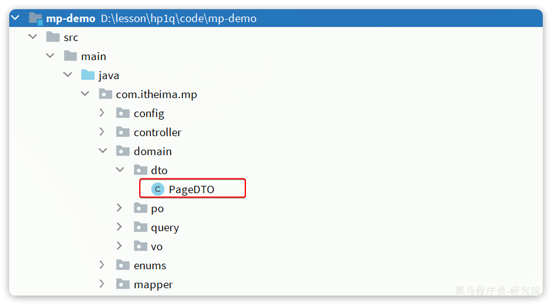

代码如下：

```Java
@Data
@ApiModel(description = "分页结果")
public class PageDTO<T> {
    @ApiModelProperty("总条数")
    private Long total;
    @ApiModelProperty("总页数")
    private Long pages;
    @ApiModelProperty("集合")
    private List<T> list;
}
```

### 4.2.2.开发接口

我们在`UserController`中定义分页查询用户的接口：

```Java
@RestController
@RequestMapping("users")
@RequiredArgsConstructor // lombok必备参数的构造函数，该构造函数包含所有被 final 修饰的字段，以及所有被 @NonNull 注解修饰的字段
public class UserController {

    private final UserService userService;

    @GetMapping("/page")
    public PageDTO<UserVO> queryUsersPage(UserQuery query){
        return userService.queryUsersPage(query);
    }

    // 。。。 略
}
```

然后在`IUserService`中创建`queryUsersPage`方法：

```Java
PageDTO<UserVO> queryUsersPage(PageQuery query);
```

接下来，在UserServiceImpl中实现该方法：

```java
@Override
public PageDTO<UserVO> queryUsersPage(UserQuery query) {
    String name = query.getName();
    Integer status = query.getStatus();
    Integer minBalance = query.getMinBalance();
    Integer maxBalance = query.getMaxBalance();
    // 1. 构建分页条件
    // 1.1 分页条件
    Page<User> page = Page.of(query.getPageNo(), query.getPageSize());
    // 1.2 构建排序条件
    if (StrUtil.isNotBlank(query.getSortBy())) { // 排序条件不为空
        page.addOrder(new OrderItem(query.getSortBy(), query.isAsc()));
    } else { // 排序条件为空
        // 默认按照更新时间降序排
        page.addOrder(new OrderItem("update_time", false));
    }
    // 2. 分页条件查询
    Page<User> p = lambdaQuery()
        .like(name != null, User::getUsername, name)
        .eq(status != null, User::getStatus, status)
        .gt(minBalance != null, User::getBalance, minBalance)
        .lt(maxBalance != null, User::getBalance, maxBalance)
        .page(page);
    // 3. 封装VO结果
    PageDTO<UserVO> dto = new PageDTO<>();
    // 3.1 总条数
    dto.setTotal(p.getTotal());
    // 3.2 总页数
    dto.setPages(p.getPages());
    // 3.3 当前页数据
    List<User> records = p.getRecords();
    if (CollUtil.isEmpty(records)) {
        dto.setList(Collections.emptyList()); // 返回空集合
        return dto;
    }
    // 3.4 拷贝UserVO
    dto.setList(BeanUtil.copyToList(records, UserVO.class));
    // 4. 返回
    return dto;
}
```

或

```Java
@Override
public PageDTO<UserVO> queryUsersPage(PageQuery query) {
    // 1.构建条件
    // 1.1.分页条件
    Page<User> page = Page.of(query.getPageNo(), query.getPageSize());
    // 1.2.排序条件
    if (query.getSortBy() != null) {
        page.addOrder(new OrderItem(query.getSortBy(), query.getIsAsc()));
    }else{
        // 默认按照更新时间排序
        page.addOrder(new OrderItem("update_time", false));
    }
    // 2.查询
    page(page);
    // 3.数据非空校验
    List<User> records = page.getRecords();
    if (records == null || records.size() <= 0) {
        // 无数据，返回空结果
        return new PageDTO<>(page.getTotal(), page.getPages(), Collections.emptyList());
    }
    // 4.有数据，转换
    List<UserVO> list = BeanUtil.copyToList(records, UserVO.class);
    // 5.封装返回
    return new PageDTO<UserVO>(page.getTotal(), page.getPages(), list);
}
```

启动项目，在页面查看：


### 4.2.3.改造PageQuery实体

在刚才的代码中，从`PageQuery`到`MybatisPlus`的`Page`之间转换的过程还是比较麻烦的。

我们完全可以**在`PageQuery`这个实体中定义一个工具方法，简化开发**。 

在PageQuery中定义方法，将PageQuery对象转为MyBatisPlus中的Page对象，像这样：

```Java
@Data
@ApiModel(description = "分页查询实体")
public class PageQuery {
    @ApiModelProperty("页码")
    private Integer pageNo = 1;
    @ApiModelProperty("页码")
    private Integer pageSize = 5;
    @ApiModelProperty("排序字段")
    private String sortBy;
    @ApiModelProperty("是否升序")
    private boolean isAsc = true;

    // 封装一些分页查询会用到的工具方法
    
    /**
     * 构建分页条件 传入多个排序方式
     * @param items 排序方式 可变参数
     * @return
     * @param <T>
     */
    public <T> Page<T> toMPPage(OrderItem... items) {
        // 1. 分页条件
        Page<T> page = Page.of(pageNo, pageSize);
        // 2. 构建排序条件
        if (StrUtil.isNotBlank(sortBy)) { // 排序条件不为空
            page.addOrder(new OrderItem(sortBy, isAsc));
        } else if (items != null){ // 排序条件为空
            // 默认排序方式
            page.addOrder(items);
        }
        return page;
    }
    /**
     * 构建分页条件 传入排序字段和排序方式
     * @param defaultSortBy 排序字段
     * @param defaultAsc 排序方式
     * @return
     * @param <T>
     */
    public <T> Page<T> toMPPage(String defaultSortBy, Boolean defaultAsc) {
        return toMPPage(new OrderItem(defaultSortBy, defaultAsc));
    }
    /**
     * 构建分页条件 默认按创建时间排序
     * @return
     * @param <T>
     */
    public <T> Page<T> toMPPageDefaultSortByCreateTime() {
        return toMPPage(new OrderItem("create_time", false));
    }
    /**
     * 构建分页条件 默认按修改时间排序
     * @return
     * @param <T>
     */
    public <T> Page<T> toMPPageDefaultSortByUpdateTime() {
        return toMPPage(new OrderItem("update_time", false));
    }
}
```

这样我们在开发也时就可以省去对从`PageQuery`到`Page`的的转换：

```Java
// 1.构建条件
Page<User> page = query.toMpPageDefaultSortByCreateTimeDesc();
```

### 4.2.4.改造PageDTO实体

在查询出分页结果后，数据的非空校验，数据的vo转换都是模板代码，编写起来很麻烦。

我们完全可以将其封装到PageDTO的工具方法中，简化整个过程。

在PageDTO中定义方法，**将MyBatisPlus中的Page结果转为PageDTO结果**：

```java
@Data
@ApiModel(description = "分页结果")
@AllArgsConstructor
@NoArgsConstructor
public class PageDTO<T> {
    @ApiModelProperty("总条数")
    private Long total;
    @ApiModelProperty("总页数")
    private Long pages;
    @ApiModelProperty("集合")
    private List<T> list;

    
    // 封装一些分页查询会用到的工具方法
    
    /**
     * 封装VO结果——分页查询
     * 将MybatisPlus分页结果转为 VO分页结果
     * 这个方法只能对两个类中属性名一样的进行拷贝
     * @param p MybatisPlus的分页结果
     * @param clazz 返回给前端的VO对象
     * @return
     * @param <PO>
     * @param <VO>
     */
    public static <PO, VO> PageDTO<VO> of(Page<PO> p, Class<VO> clazz) {
        // 封装VO结果
        PageDTO<VO> dto = new PageDTO<>();
        // 1. 总条数
        dto.setTotal(p.getTotal());
        // 2. 总页数
        dto.setPages(p.getPages());
        // 3. 当前页数据
        List<PO> records = p.getRecords();
        if (CollUtil.isEmpty(records)) {
            dto.setList(Collections.emptyList()); // 返回空集合
            return dto;
        }
        // 4. 拷贝VO
        dto.setList(BeanUtil.copyToList(records, clazz));

        // 5. 返回
        return dto;
    }

    /**
     * 封装VO结果——分页查询
     * 将MybatisPlus分页结果转为 VO分页结果
     * 自定义拷贝逻辑
     * @param p
     * @param convertor
     * @return
     * @param <PO>
     * @param <VO>
     */
    public static <PO, VO> PageDTO<VO> of(Page<PO> p, Function<PO, VO> convertor) {
        // 封装VO结果
        PageDTO<VO> dto = new PageDTO<>();
        // 1. 总条数
        dto.setTotal(p.getTotal());
        // 2. 总页数
        dto.setPages(p.getPages());
        // 3. 当前页数据
        List<PO> records = p.getRecords();
        if (CollUtil.isEmpty(records)) {
            dto.setList(Collections.emptyList()); // 返回空集合
            return dto;
        }
        // 4. 拷贝VO
        dto.setList(records.stream().map(convertor).collect(Collectors.toList()));
        // 5. 返回
        return dto;
    }

    /**
     * 返回空分页结果
     * 将MybatisPlus分页结果转为 VO分页结果
     * @param p
     * @return
     * @param <V>
     * @param <P>
     */
    public static <V, P> PageDTO<V> empty(Page<P> p){
        return new PageDTO<>(p.getTotal(), p.getPages(), Collections.emptyList());
    }
}
```

**最终，业务层的代码可以简化为：**

```Java
@Override
public PageDTO<UserVO> queryUserByPage(PageQuery query) {
    // 1.构建条件
    Page<User> page = query.toMpPageDefaultSortByCreateTimeDesc();
    // 2.查询
    page(page);
    // 3.封装返回
    return PageDTO.of(page, UserVO.class);
}
```

如果是希望自定义PO到VO的转换过程，可以这样做：

```Java
@Override
public PageDTO<UserVO> queryUserByPage(PageQuery query) {
    // 1.构建条件
    Page<User> page = query.toMpPageDefaultSortByCreateTimeDesc();
    // 2.查询
    page(page);
    // 3.封装返回
    return PageDTO.of(page, user -> {
        // 3.1 拷贝属性到VO
        UserVO vo = BeanUtil.copyProperties(user, UserVO.class);
        // 3.2 处理特殊逻辑
        // 比如说对用户名隐藏后两位为**
        String username = vo.getUsername();
        vo.setUsername(username.substring(0, username.length() - 2) + "");
        return vo;
    });
}
```

最终查询的结果如下：


> 注：如果我们用的不只有mp我们尽量把工具方法与实体解耦，专门创一个工具类

# 5.作业

尝试改造项目一中的`Service`层和`Mapper`层实现，用`MybatisPlus`代替单表的CRUD

> 暂时未做